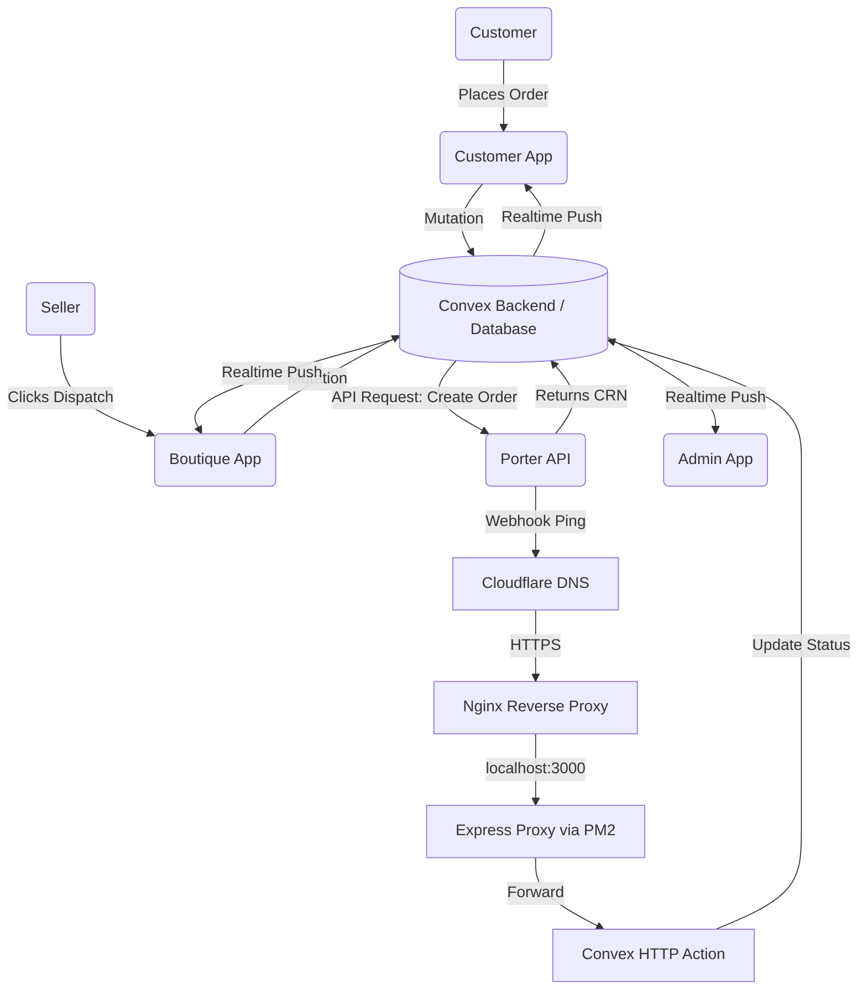
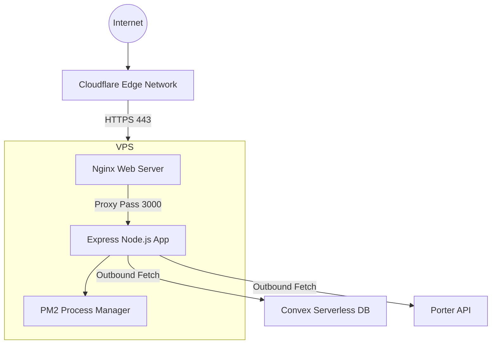
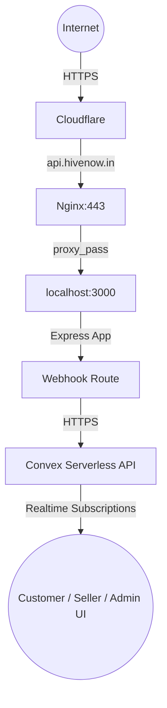
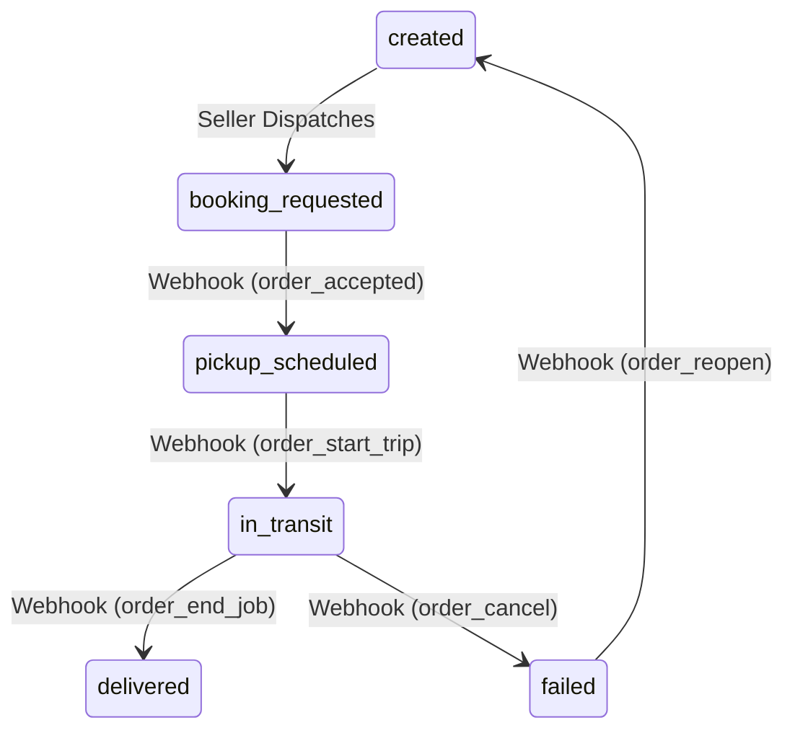

# Hive Engineering Handbook
## Porter Logistics System
### Version 1.0 (FINAL)
### Confidential – Hive Engineering Team Only

**Last Updated:** July 2026  
**Prepared By:** Hive Core Engineering Team  

---

# Table of Contents
1. [Chapter 1: Introduction](#chapter-1-introduction)
2. [Chapter 2: System Overview](#chapter-2-system-overview)
3. [Chapter 3: Production Infrastructure](#chapter-3-production-infrastructure)
4. [Chapter 4: Actual Server Specifications](#chapter-4-actual-server-specifications)
5. [Chapter 5: Cloudflare Configuration](#chapter-5-cloudflare-configuration)
6. [Chapter 6: Network Architecture](#chapter-6-network-architecture)
7. [Chapter 7: Nginx](#chapter-7-nginx)
8. [Chapter 8: PM2](#chapter-8-pm2)
9. [Chapter 9: Express Deployment](#chapter-9-express-deployment)
10. [Chapter 10: SSL](#chapter-10-ssl)
11. [Chapter 11: Deployment History](#chapter-11-deployment-history)
12. [Chapter 12: Server Commands](#chapter-12-server-commands)
13. [Chapter 13: Repository Structure](#chapter-13-repository-structure)
14. [Chapter 14: Database Architecture](#chapter-14-database-architecture)
15. [Chapter 15: Shipment Lifecycle](#chapter-15-shipment-lifecycle)
16. [Chapter 16: Order Lifecycle](#chapter-16-order-lifecycle)
17. [Chapter 17: Porter Integration](#chapter-17-porter-integration)
18. [Chapter 18: Convex Architecture](#chapter-18-convex-architecture)
19. [Chapter 19: Customer Flow](#chapter-19-customer-flow)
20. [Chapter 20: Seller Flow](#chapter-20-seller-flow)
21. [Chapter 21: Admin Flow](#chapter-21-admin-flow)
22. [Chapter 22: Webhook System](#chapter-22-webhook-system)
23. [Chapter 23: Realtime System](#chapter-23-realtime-system)
24. [Chapter 24: Security](#chapter-24-security)
25. [Chapter 25: Monitoring](#chapter-25-monitoring)
26. [Chapter 26: Troubleshooting](#chapter-26-troubleshooting)
27. [Chapter 27: Disaster Recovery](#chapter-27-disaster-recovery)
28. [Chapter 28: Operations Manual](#chapter-28-operations-manual)
29. [Chapter 29: Production Deployment Checklist](#chapter-29-production-deployment-checklist)
30. [Chapter 30: Appendix](#chapter-30-appendix)

---

# Chapter 1: Introduction

## What is Hive?
Hive is a premium, managed marketplace connecting boutiques and tailors directly with customers. We handle the discovery, payment, and physical logistics required to deliver bespoke and ready-to-wear garments seamlessly. 

## Business Model
Hive charges a platform fee for facilitating transactions between sellers (boutiques) and buyers (customers). A core pillar of our value proposition is offering a completely abstracted, hands-off logistics experience. Sellers focus on creating garments; Hive handles getting the garment to the customer's door.

## Why Logistics Matters
In the premium fashion space, the delivery experience is the final touchpoint with the customer. If logistics fail—if packages are lost, delayed, or un-trackable—the customer blames Hive, not the courier. Robust, transparent, and realtime logistics are critical to maintaining trust and driving repeat purchases.

## Why Porter Was Selected
Porter offers on-demand, hyper-local delivery services with robust API support. Their infrastructure allows for programmatic booking, instant driver assignment, and realtime webhook updates. This enables Hive to completely automate the delivery process without manual operational overhead.

## Purpose of this Handbook
This handbook is the definitive, permanent engineering record for the Hive Logistics System. It serves as the primary onboarding and operational manual for all engineering and operations staff.

## Target Audience
This document is written for Backend Developers, Frontend Developers, DevOps Engineers, Operations Teams, and Future Founders. It assumes no prior knowledge of the Hive codebase.

---

# Chapter 2: System Overview

## High Level Architecture
The Hive logistics system coordinates state across three independent Next.js frontend applications, a unified Convex backend, and an Express Proxy acting as the public webhook gateway.

When a customer orders a garment, the seller triggers a dispatch from their dashboard. The Convex backend securely calls the Porter API to book a rider. As the rider moves, Porter sends asynchronous webhooks to our Express Proxy (`api.hivenow.in`). The proxy forwards these to Convex, which instantly pushes WebSocket updates to all connected UIs.



### Components Explained
- **Customer App:** A Next.js application where buyers track their orders.
- **Boutique App:** A Next.js application where sellers manage and dispatch orders.
- **Admin App:** A Next.js application where operators monitor system health.
- **Convex Backend:** The serverless database, API layer, and real-time engine.
- **Express Proxy:** A lightweight Node.js intermediary running on an Ubuntu VPS, validating incoming webhooks.
- **Porter API:** The external logistics provider.

---

# Chapter 3: Production Infrastructure

The Hive logistics production infrastructure runs on a reliable, vertically integrated stack combining edge networking, a dedicated VPS, and a serverless database.

## Real Infrastructure Diagram



## Component Responsibilities

### Cloudflare
- **Purpose:** DNS resolution, DDoS protection, and SSL termination at the edge.
- **Responsibility:** Routes `api.hivenow.in` to `64.227.185.103` using A Records.

### Nginx
- **Purpose:** Reverse Proxy and Web Server.
- **Responsibility:** Listens on port 80 and 443, enforces HTTPS, handles the Let's Encrypt SSL certificate, and proxies traffic to localhost:3000.

### PM2
- **Purpose:** Daemon Process Manager.
- **Responsibility:** Keeps the Express proxy alive permanently. Restarts the app if it crashes, manages logs, and auto-starts the app on server reboot via systemd.

### Express Proxy
- **Purpose:** Webhook ingestion layer.
- **Responsibility:** Listens on port 3000, receives Porter webhooks, and forwards them to Convex.

---

# Chapter 4: Actual Server Specifications

The production proxy runs on a dedicated DigitalOcean droplet located in the Bangalore (blr1) datacenter.

| Component | Specification |
|---|---|
| **Cloud Provider** | DigitalOcean (`ubuntu-s-1vcpu-512mb-10gb-blr1`) |
| **Operating System** | Ubuntu 24.04.4 LTS (Noble) |
| **Kernel** | 6.8.0-124-generic x86_64 |
| **Server IP (eth0)** | `64.227.185.103` (IPv4) |
| **Internal IP (eth0)** | `10.47.0.5` |
| **CPU** | 1 vCPU |
| **RAM** | 512 MB Total (typically ~50% utilized) |
| **Disk Storage** | 10 GB SSD (3.5 GB used, 5.2 GB available) |
| **Node.js Version** | v18.19.1 |
| **NPM Version** | 9.2.0 |
| **Nginx Version** | 1.24.0 (Ubuntu) |
| **PM2 Version** | 5.3+ (managing `porter-proxy`) |

---

# Chapter 5: Cloudflare Configuration

Cloudflare acts as the edge layer for the Express proxy.

- **DNS:** An `A` Record is configured pointing `api.hivenow.in` to the server IP `64.227.185.103`.
- **Proxy Status:** Proxy is **Enabled** (Orange Cloud).
- **TTL:** Auto.

## Why Cloudflare is used
Cloudflare is used to mask the true origin IP of our DigitalOcean server, preventing direct internet attacks. It also acts as an edge cache and provides immediate DDoS mitigation against webhook floods.

## Request Flow
1. **Internet:** Porter fires a webhook to `https://api.hivenow.in`.
2. **Cloudflare:** The request hits Cloudflare edge nodes, where basic malicious traffic is filtered.
3. **api.hivenow.in:** Cloudflare routes the cleaned traffic to `64.227.185.103`.
4. **Nginx:** The Ubuntu server's Nginx receives the request on port 443.
5. **Express:** Nginx proxies the request to `localhost:3000`.
6. **Porter:** Webhook payload is processed and eventually synchronized with Convex.

---

# Chapter 6: Network Architecture



---

# Chapter 7: Nginx

Nginx acts as a reverse proxy, sitting between the internet and the Express app.

**Location:** `/etc/nginx/sites-enabled/api.hivenow.in`

### Actual Configuration
```nginx
server {
    server_name api.hivenow.in;

    location / {
        proxy_pass http://127.0.0.1:3000;
        proxy_http_version 1.1;
        proxy_set_header Host $host;
        proxy_set_header X-Real-IP $remote_addr;
        proxy_set_header X-Forwarded-For $proxy_add_x_forwarded_for;
        proxy_set_header X-Forwarded-Proto $scheme;
        proxy_read_timeout 90;
    }

    listen 443 ssl; # managed by Certbot
    ssl_certificate /etc/letsencrypt/live/api.hivenow.in/fullchain.pem; # managed by Certbot
    ssl_certificate_key /etc/letsencrypt/live/api.hivenow.in/privkey.pem; # managed by Certbot
    include /etc/letsencrypt/options-ssl-nginx.conf; # managed by Certbot
    ssl_dhparam /etc/letsencrypt/ssl-dhparams.pem; # managed by Certbot
}

server {
    if ($host = api.hivenow.in) {
        return 301 https://$host$request_uri;
    } # managed by Certbot

    listen 80;
    server_name api.hivenow.in;
    return 404; # managed by Certbot
}
```

### Explanation of Directives
- **`listen 80`**: Nginx listens for unencrypted HTTP traffic.
- **`return 301 https...`**: If anyone tries to access the site via HTTP, they are forced (redirected) to HTTPS.
- **`listen 443 ssl`**: Nginx listens for encrypted HTTPS traffic.
- **`proxy_pass http://127.0.0.1:3000`**: Nginx takes the decrypted traffic and silently forwards it to the internal Node.js app running on port 3000.
- **`proxy_set_header`**: These directives ensure that the Express app knows the original IP of the sender, instead of thinking every request came from "127.0.0.1" (Nginx itself).
- **`ssl_certificate`**: Points to the Let's Encrypt certificates managed by Certbot.

---

# Chapter 8: PM2

PM2 is a production process manager for Node.js. It ensures the webhook receiver never dies.

**Actual PM2 State (`pm2 show porter-proxy`):**
- **ID:** 0
- **Name:** `porter-proxy`
- **Mode:** fork_mode
- **Status:** online
- **Node.js Version:** 18.19.1
- **Restart Count:** 31
- **Uptime:** 24h
- **Memory:** 49.3mb (Heap Size: 15.42 MiB)
- **Script Path:** `/root/porter-proxy/index.js`

### Log Locations
- **Standard Out:** `/root/.pm2/logs/porter-proxy-out.log`
- **Error Out:** `/root/.pm2/logs/porter-proxy-error.log`

### Startup and Recovery
PM2 is installed as a system service.
- **Startup Script:** `/etc/systemd/system/pm2-root.service`
- If the Ubuntu VPS boots up, it automatically launches PM2, which in turn reads `/root/.pm2/dump.pm2` and restores the `porter-proxy` application.

### Important PM2 Commands Explained
- **`pm2 restart porter-proxy`**: Hard kills the Node process and starts it again. Momentary downtime.
- **`pm2 reload porter-proxy`**: Gracefully restarts the application with zero downtime.
- **`pm2 save`**: Freezes the current list of running applications so they survive a server reboot.
- **`pm2 startup`**: Generates the systemd script to make PM2 launch on boot.

---

# Chapter 9: Express Deployment

The Express application is a lightweight Node.js router that accepts the Porter payload and bridges it to Convex.

**Folder Structure:** `/root/porter-proxy/`
- `index.js`: The Express server logic.
- `.env`: Holds the `CONVEX_WEBHOOK_URL` and `PORTER_WEBHOOK_SECRET`.
- `package.json`: Manages dependencies (`express`, `axios`, `dotenv`).
- `node_modules/`: Installed packages.

### Deployment Updates
If you change `index.js` or `.env`, you must apply the changes gracefully:
```bash
cd /root/porter-proxy
nano index.js
pm2 reload porter-proxy --update-env
```
This performs a zero-downtime reload of the webhook receiver, ensuring no webhooks from Porter are dropped during the update.

---

# Chapter 10: SSL

SSL encryption ensures payloads from Porter cannot be intercepted.

- **Provider:** Let's Encrypt (managed via Certbot).
- **Certificate Location:** `/etc/letsencrypt/live/api.hivenow.in/fullchain.pem`
- **Private Key Location:** `/etc/letsencrypt/live/api.hivenow.in/privkey.pem`
- **Renewal:** Certbot automatically creates a systemd timer (`/etc/letsencrypt/options-ssl-nginx.conf`) to renew the certificate before it expires.
- **Current Expiry:** 2026-10-27 07:56:08+00:00 (Valid for 88 days).

HTTPS is strictly enforced by Nginx and Cloudflare.

---

# Chapter 11: Deployment History

The production server was built from a clean Ubuntu image using the following sequence. This serves as the professional deployment guide for rebuilding the server if necessary.

1. **System Preparation:**
   ```bash
   sudo apt update
   sudo apt install -y nodejs npm git
   ```
2. **Application Scaffolding:**
   ```bash
   mkdir ~/porter-proxy
   cd ~/porter-proxy
   npm init -y
   npm install express axios dotenv
   ```
3. **Application Configuration:**
   - `index.js` and `.env` were created to hold the webhook forwarding logic and secrets.
   - Tested manually using `node index.js` and `curl http://localhost`.
4. **PM2 Daemonization:**
   ```bash
   sudo npm install -g pm2
   pm2 start index.js --name porter-proxy
   pm2 save
   pm2 startup
   ```
5. **Nginx Reverse Proxy:**
   - Configured `/etc/nginx/sites-available/api.hivenow.in` to proxy port 3000.
   ```bash
   sudo ln -s /etc/nginx/sites-available/api.hivenow.in /etc/nginx/sites-enabled/
   sudo rm -f /etc/nginx/sites-enabled/default
   sudo nginx -t
   sudo systemctl reload nginx
   ```
6. **SSL Generation:**
   ```bash
   sudo apt install certbot python3-certbot-nginx -y
   sudo certbot --nginx -d api.hivenow.in
   ```
7. **Webhook Testing:**
   - Simulated Porter payloads via `curl -X POST https://api.hivenow.in/v1/webhooks/porter -H "x-api-key: YOUR_SECRET" ...` to verify end-to-end functionality.

---

# Chapter 12: Server Commands

A complete reference of essential commands used to manage the server.

| Command | Explanation |
|---|---|
| `pm2 list` | Shows all Node.js apps running, their memory, and restart counts. |
| `pm2 show porter-proxy` | Shows log paths, uptime, and specific memory heap usage. |
| `pm2 logs` | Streams the console.log output of the Express app. |
| `pm2 restart porter-proxy` | Kills and restarts the app. Causes momentary downtime. |
| `pm2 reload porter-proxy` | Gracefully reloads the app with zero downtime. |
| `pm2 save` | Freezes the current list of running apps so they survive a server reboot. |
| `pm2 startup` | Generates the systemd script to make PM2 launch on boot. |
| `nginx -t` | Validates Nginx syntax before applying changes. Prevents crashing the web server. |
| `systemctl reload nginx` | Applies new Nginx configurations without dropping active connections. |
| `certbot certificates` | Shows the domain names and expiry dates of installed SSL certs. |
| `ss -tulpn` | Shows what applications are listening on which ports (e.g. 80, 443, 3000, 22). |

---

# Chapter 13: Repository Structure

The logistics integration spans across the `convex/` backend folder, the `apps/` frontend workspaces, and the dedicated `/root/porter-proxy/` folder on the VPS.

### File Details

| File Path | Purpose | Responsibilities | Calls / Called By |
|---|---|---|---|
| `convex/lib/porter.ts` | Porter SDK | API interaction (quotes, booking, tracking) | Called by dispatch mutations and webhooks. |
| `convex/webhooks/porter.ts` | Webhook Endpoint | Validates payload, triggers DB updates. | Called by Express Proxy. |
| `convex/adminLogistics.ts` | State Machine | Processes status updates safely. | Called by Webhooks. |
| `convex/schema.ts` | Database Schema | Defines `shipments` collection and indexes. | N/A |

---

# Chapter 14: Database Architecture

Hive uses Convex as its NoSQL datastore.

## Why Shipment is the Single Source of Truth
In distributed logistics, data duplication causes race conditions. If an order and a shipment both store the "tracking status", they will eventually fall out of sync. Hive strictly stores all physical tracking data on the `shipments` collection. The `orders` collection merely holds a reference (`shipmentId`). All queries map the shipment data into the order at runtime.

## The `shipments` Collection

**Purpose:** Tracks the physical movement of a package.

| Field | Type | Description |
|---|---|---|
| `_id` | `Id("shipments")` | Internal Convex ID. |
| `orderId` | `Id("orders")` | The purchase this shipment fulfills. |
| `awbNumber` | `string` | The Porter CRN (Customer Reference Number). Used for webhook lookup. |
| `status` | `string` | The current state (e.g., `pickup_scheduled`, `delivered`). |
| `driverName` | `string` | Driver's full name. |
| `liveTrackingUrl` | `string` | Public URL for map tracking. |
| `rawWebhookEvents` | `Array` | Append-only log of every ping from Porter. |

## Indexes
Indexes allow Convex to find records in `O(1)` time. 
- **`by_awbNumber`**: `["awbNumber"]`. This is the most critical index. When Porter sends a webhook, they only send the `order_id` (CRN). This index allows the webhook to instantly find the correct shipment to update.
- **`by_status`**: `["status"]`. Used by the Admin queue to find active or failed shipments.

---

# Chapter 15: Shipment Lifecycle

A shipment moves through a strict, unidirectional state machine.



## Step-by-Step Breakdown
1. **Created:** Seller clicks "Mark as Packed". Blank shipment row created.
2. **Booking Requested:** Seller clicks "Dispatch". `createOrder` called.
3. **Pickup Scheduled:** Porter webhook `order_accepted`.
4. **In Transit:** Porter webhook `order_start_trip`.
5. **Delivered:** Porter webhook `order_end_job`.

---

# Chapter 16: Order Lifecycle

The order lifecycle wraps the shipment lifecycle. 
1. **Checkout:** Customer selects items. `orders` row created.
2. **Payment:** Razorpay confirms funds. Order moves to `confirmed`.
3. **Fulfillment:** Seller triggers shipment lifecycle.
4. **Delivery:** When Shipment reaches `delivered`, the `orders` row mirrors the completion.

---

# Chapter 17: Porter Integration

All external API interactions are isolated in `convex/lib/porter.ts`. 

### 1. Create Order
- **Endpoint:** `POST /v1/orders/create`
- **Authentication:** `x-api-key` header.
- **Payload:** Pickup address, delivery address, and an idempotency key (`request_id`).
- **Response:** Returns the CRN (`order_id`).

### 2. Get Order Details
- **Endpoint:** `GET /v1/orders/:crn`
- **Where Used:** Inside the webhook handler during `order_accepted` to fetch driver details.

---

# Chapter 18: Convex Architecture

Convex is a reactive backend. 
- **Queries:** Read-only functions that automatically subscribe to the database. If the data changes, Convex pushes the new result to the client.
- **Mutations:** Write functions. They are ACID compliant. If a mutation fails, it rolls back entirely.
- **Internal Actions:** Server-side functions that call Porter API securely.
- **HTTP Actions:** Standard REST endpoints used for receiving Webhooks from the Express proxy.

---

# Chapter 19: Customer Flow

1. Customer visits `apps/customer/src/app/orders/[orderId]/page.tsx`.
2. Component calls `useQuery(api.orders.getOrderByIdInternal)`.
3. The page renders the `TrackingTimeline`.
4. The timeline dynamically maps the Convex `status` to UI steps.
5. The `DriverTrackingCard` displays the Rider's Name, Phone, and ETA.

---

# Chapter 20: Seller Flow

1. Seller opens `apps/boutique/src/app/boutique/orders/page.tsx`.
2. Seller clicks "Dispatch".
3. Frontend triggers `readyForPickup` mutation.
4. Backend executes `createOrder` via Porter SDK.
5. Once the webhook assigns a driver, the Seller UI dynamically renders the Rider Information card.

---

# Chapter 21: Admin Flow

1. Admin visits `apps/admin/src/app/admin/logistics/[id]/ShipmentDetailsClient.tsx`.
2. Admin views the "Rider Assignment" card.
3. Below the rider card, the "Tracking Event History" maps over `shipment.rawWebhookEvents`. 

---

# Chapter 22: Webhook System

Webhooks are how Porter informs Hive of physical world events.

## Processing Flow
1. **Receive:** Express proxy receives the webhook payload from Porter.
2. **Forward:** Express forwards the JSON payload to Convex.
3. **Validate:** Convex validates the signature.
4. **Map:** `order_accepted` maps to `pickup_scheduled`.
5. **Enrich:** Convex reaches out to Porter `GET /v1/orders/:crn` to grab missing driver details.
6. **Update:** Dispatches a background mutation (`processLogisticsStatusUpdateInternal`) using the `awbNumber` index.
7. **Acknowledge:** Convex returns 200 to Express, Express returns `200 OK` to Porter.

---

# Chapter 23: Realtime System

Hive does not use polling. 
1. Next.js calls `useQuery`.
2. Convex opens a WebSocket connection.
3. When the Porter Webhook patches the `shipments` table, the Convex database engine detects the change.
4. Convex identifies all active WebSocket connections querying that shipment.
5. Convex pushes the exact diff to the Customer, Seller, and Admin UIs instantly.

---

# Chapter 24: Security

- **Webhook Security:** Webhooks require the `x-api-key` header.
- **Fail Closed:** If the webhook secret is missing, or set to a mock value in production, the webhook route returns a 500 error and refuses to process data.
- **Data Integrity:** `processLogisticsStatusUpdateInternal` enforces a valid state machine to prevent malicious or out-of-order webhooks from corrupting shipment statuses.

---

# Chapter 25: Monitoring

The Hive infrastructure is monitored across multiple layers:

### PM2 Monitoring
Run `pm2 monit` on the server for real-time CPU and Memory usage.
- **Process Memory:** The Express app consumes ~49.3MB of RAM.
- **Restart Count:** If the restart count (currently `31`) is increasing rapidly, the app is crashing and requires investigation.
- **Logs:** Use `pm2 logs porter-proxy --lines 1000` to view historical logs.

### Nginx Monitoring
- **Ports:** Nginx binds to `80` (HTTP) and `443` (HTTPS). Use `ss -tulpn` to verify bindings.
- **Access Logs:** `/var/log/nginx/access.log`
- **Error Logs:** `/var/log/nginx/error.log`

### Webhook Monitoring
Convex provides internal logging within the Convex Dashboard for background mutation failures (e.g. `[PorterWebhook] Background mutation error: State machine violation...`).

---

# Chapter 26: Troubleshooting

### Webhook Failed / Not Updating
1. **Symptom:** Porter app shows picked up, Hive UI shows waiting.
2. **Check:** Run `pm2 logs porter-proxy --lines 50` on the server.
3. **Fix:** Ensure `.env` is correct and PM2 is running. Check Convex Logs.

### Missing Rider Details
1. **Symptom:** UI says "Waiting for Porter to assign a rider" but a rider is assigned.
2. **Check:** Did the `syncOrderDetails` action fail in Convex?
3. **Fix:** Check `PORTER_API_KEY` validity.

---

# Chapter 27: Disaster Recovery

### If PM2 crashes
PM2 is configured as a systemd service (`pm2-root.service`). If PM2 dies, the operating system will restart it. If `porter-proxy` crashes, PM2 will instantly restart it.

### If Nginx stops
Run `sudo systemctl restart nginx`. Nginx is required for SSL termination and routing. Without it, webhooks will bounce.

### If SSL expires
Let's Encrypt is configured for automatic renewal via Certbot. If it fails, run `sudo certbot renew --nginx`. If the SSL expires, Porter will refuse to send webhooks to `api.hivenow.in`.

### If DNS breaks / Cloudflare is disabled
If Cloudflare proxying is disabled, traffic will route directly to `64.227.185.103`. The server is configured to accept direct traffic, but you will lose DDoS protection.

### If Express stops
PM2 will auto-restart it. If the server reboots, the `pm2 startup` script ensures Express boots alongside Ubuntu.

### If Porter is unavailable
If Porter's API goes down, `createOrder` throws an error. The Seller UI will display an alert. The shipment remains in `created` state. Sellers must retry later.

---

# Chapter 28: Operations Manual

**Daily:**
- Open Admin Logistics Control Tower. Filter by `status === "failed"`. Resolve manually.
- Run `pm2 list` on the server to ensure uptime is stable and restarts aren't rapidly increasing.

**Weekly:**
- Audit `rawWebhookEvents` for anomalies (e.g., shipments stuck in `in_transit` for > 48 hours).

**Monthly:**
- **Server Maintenance:** SSH into the server: `sudo apt update && sudo apt upgrade -y`.
- **SSL Status:** Check SSL status: `sudo certbot certificates` to ensure expiry is > 30 days.

---

# Chapter 29: Production Deployment Checklist

- [ ] Ensure `PORTER_API_URL` is production in Convex.
- [ ] Ensure `CONVEX_WEBHOOK_URL` is correct in `/root/porter-proxy/.env`.
- [ ] Generate secure UUID for `PORTER_WEBHOOK_SECRET`.
- [ ] Register `https://api.hivenow.in/v1/webhooks/porter` in Porter Dashboard.
- [ ] Ensure Nginx syntax is valid (`nginx -t`).
- [ ] Run `pm2 save` on the server to freeze the process list.
- [ ] Perform one end-to-end live test order.

---

# Chapter 30: Appendix

### Glossary
- **CRN:** Customer Reference Number (Porter's `order_id`).
- **PM2:** Production Process Manager for Node.js.
- **Idempotency:** An operation that can be applied multiple times without changing the result beyond the initial application.

---
**End of Document**
