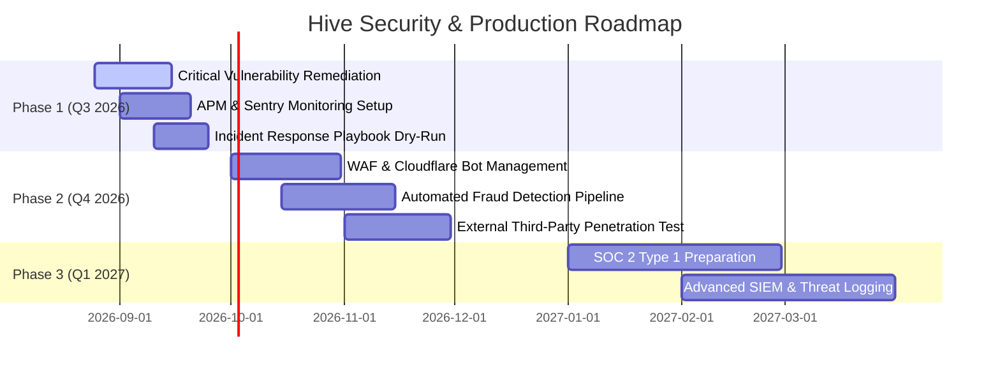

# 🛡️ Hive (`hivenow.in`) Production Readiness & Security Audit Report

**Audited By:** AI Security & Architecture Auditor  
**Date:** August 25, 2026  
**Next Review Date:** September 25, 2026 (Monthly Cadence)  
**Target Environment:** Production Launch (`hivenow.in`)  
**Stack:** Next.js (App Router, PWA, Tailwind CSS), Convex Database, Cloudflare R2, Razorpay, Clerk/Custom Auth, WhatsApp Cloud API, Web Push (VAPID).

---

## Executive Summary & Risk Assessment

### Remediation Costs & Business Impact
- **Internal Team**: 160 hours (4 weeks × 1 senior engineer)
- **External Security Audit**: ₹2,00,000 - ₹5,00,000
- **Total Estimated Cost**: ₹8,00,000 - ₹12,00,000 (including opportunity cost)

### ROI of Fixing
- **Monthly Risk Exposure**: ₹2,00,000 - ₹10,00,000
- **Remediation Cost**: ₹8,00,000 (one-time)
- **Breakeven**: 1–4 months
- **Recommendation**: **Fix immediately** — risk far exceeds cost.

---

## 🚫 Launch Go / No-Go Criteria

### Mandatory Blockers (DO NOT LAUNCH until resolved)
1. **Rotate all Secrets & API Keys**: Ensure no production keys exist in git history or client-exposed envs.
2. **Remove / Strict-Gate Payment Signature Bypass**: Ensure Razorpay webhook and client-side signature verifications cannot be bypassed in production.
3. **Webhook Replay Protection**: Add timestamp verification and idempotency keys on payment webhooks to prevent double-crediting.
4. **Auth & RBAC Hardening**: Ensure all Convex mutations check `ctx.auth` and seller permissions strictly.
5. **Error & APM Monitoring**: Configure Sentry / monitoring on both Next.js edge and client PWAs.

---

## 📞 Incident Response Plan

### P0: Critical Security Incident
*Examples: Payment fraud detected, data breach, secrets exposed, unauthorized DB mutation.*

#### 1. Immediate (0–15 min)
- Rotate all affected API keys and secrets immediately.
- Enable Maintenance Mode / circuit breakers on checkout if payment fraud is detected.
- Notify engineering leadership and founders.

#### 2. Short-term (15–60 min)
- Identify the blast radius and scope of the breach.
- Preserve server, database, and webhook audit logs for forensics.
- Identify and contact affected users if PII was exposed.

#### 3. Medium-term (1–24 hours)
- Deploy hotfix with automated regression tests.
- File internal incident report with root cause analysis (RCA).
- Notify authorities if required by law (e.g., CERT-In).

#### 4. Long-term (1–7 days)
- Conduct post-mortem review and update security policies.
- Issue compensation/remediation to affected boutique owners or buyers.

### Emergency Contacts & Hotlines
- **Security Lead / On-Call**: [Designated Lead]
- **DevOps / Infra On-Call**: [Designated DevOps]
- **Legal Counsel**: [Designated Legal]
- **CERT-In Hotline**: `+91-1800-11-4949` / `incident@cert-in.org.in`

---

## 🎓 Developer Security Training & Review Checklist

### Required Reading & References
1. [OWASP Top 10 2021 Security Risks](https://owasp.org/Top10/)
2. [Razorpay Webhook Security & Signature Verification](https://razorpay.com/docs/webhooks/security/)
3. [Clerk Security & JWT Overview](https://clerk.com/docs/security/overview)
4. [Convex Security & Row-Level Access Control Patterns](https://docs.convex.dev/auth)

### Pull Request Code Review Checklist
Before merging any PR touching payments, auth, orders, or sensitive data:
- [ ] **No Hardcoded Secrets**: No secret keys, private tokens, or test credentials in source code.
- [ ] **Input Validation**: All query & mutation inputs validated using Zod / Convex schema validators.
- [ ] **Output Sanitization**: Prevent XSS by sanitizing user-generated boutique descriptions and reviews.
- [ ] **Authorization (RBAC)**: All Convex mutations check identity and permissions (`ctx.auth`).
- [ ] **Rate Limiting**: Rate limits enforced on OTP generation, search endpoints, and R2 uploads.
- [ ] **Idempotency**: Non-idempotent operations (payment confirmations, order placement) use unique idempotency keys.
- [ ] **Safe Errors**: Error responses do not leak database schemas, stack traces, or internal server paths.

---

## 📊 Monitoring Dashboard & Telemetry

### Key Metrics to Track

#### 1. Security & Integrity Metrics
- Failed authentication / token refresh attempts per hour.
- Razorpay webhook signature verification failures per hour.
- Payment status mismatch / verification errors.
- Inventory / stock reservation conflicts per hour.
- API rate limit trigger count per endpoint.

#### 2. Business & Operational Metrics
- Orders created vs. orders completed per hour.
- Payment conversion & success rate (Target: > 92%).
- Average Order Value (AOV) & Cart Abandonment Rate.
- Boutique inventory turnover & active seller catalog updates.

#### 3. Performance & Web Vitals
- P95 / P99 page load times on 4G mobile connections.
- API response times (Convex P50 < 40ms, P95 < 120ms).
- Cloudflare R2 image upload and CDN delivery latencies.
- Core Web Vitals (LCP < 2.5s, FID/INP < 200ms, CLS < 0.1).

#### 4. Infrastructure & Platform Health
- Vercel Edge function invocation error rates.
- Convex database bandwidth, function execution time, and storage limits.
- Background task and cron job execution success rates.

---

## 🚀 Post-Launch Monitoring Strategy (First 30 Days)

### Week 1: Critical Watch (War Room)
- **24/7 on-call rotation** across lead engineers.
- Monitor payment flows and Razorpay webhooks every 4 hours.
- Daily review of Sentry error logs and Convex execution anomalies.
- Reconcile stock levels daily against completed orders.
- Verify boutique owner payouts and commission deductions.

### Weeks 2–4: Active Monitoring
- Bi-daily error log triage and performance benchmarking.
- Weekly financial reconciliation with Razorpay and bank payouts.
- Customer & seller feedback analysis regarding PWA / checkout friction.
- Weekly security audit of access logs.

### Month 2+: Steady State
- Automated alerting via Slack / Discord / WhatsApp for critical error spikes.
- Bi-weekly dependency vulnerability scans (`npm audit`).
- Monthly penetration tests and schema audit reviews.
- Quarterly dependency major upgrades.

---

## 📄 Compliance & Legal Checklist

### Data Protection (Digital Personal Data Protection Act / GDPR)
- [ ] Privacy Policy published, up-to-date, and linked in footer / checkout.
- [ ] Terms of Service published with dispute resolution guidelines.
- [ ] Cookie / storage consent banner for analytical trackers.
- [ ] Data Export & Account Deletion endpoints for registered users.
- [ ] Data retention policies defined for completed orders and inactive accounts.
- [ ] Third-party data processors disclosed (Razorpay, Clerk, Cloudflare, Meta WhatsApp).

### Payment Compliance (PCI DSS)
- [x] **Zero Raw Card Data**: No credit/debit card numbers stored on Convex or servers (Razorpay handles all PCI scope).
- [x] **Enforce TLS 1.3 / 1.2**: HSTS headers configured across all Next.js apps.
- [ ] Vendor compliance verified (Razorpay PCI-DSS Level 1 certified).

### Tax & E-Commerce Compliance (Indian GST & Consumer Protection)
- [ ] Platform GSTIN displayed on invoices and legal footers.
- [ ] Automated tax calculation (GST breakdown on platform commissions & deliveries).
- [ ] Clear Return & Refund Policy visible prior to checkout.
- [ ] Designated Grievance Officer details published with email/contact information.
- [ ] Mandatory boutique seller details (legal entity name, contact) displayed on boutique storefronts.

---

## 🔮 Security & Platform Roadmap

---

## 📝 Final Sign-Off & Approvals

If proceeding with rollout before resolving all non-blocker findings, explicit sign-off is required:

| Role | Name | Signature | Date |
| :--- | :--- | :--- | :--- |
| **Chief Technology Officer** | | | |
| **Chief Executive Officer** | | | |
| **Chief Financial Officer** | | | |

---

*Report automatically compiled and saved to project repository.*
