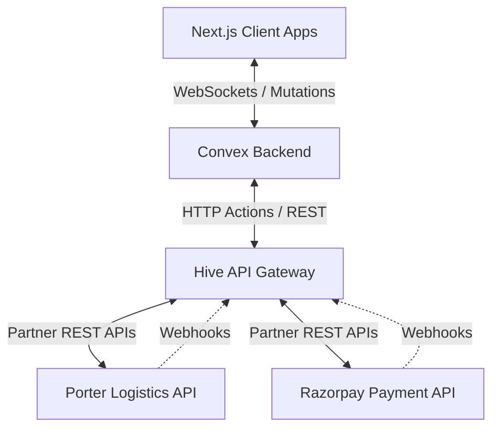
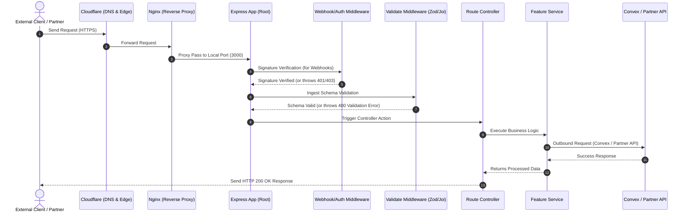
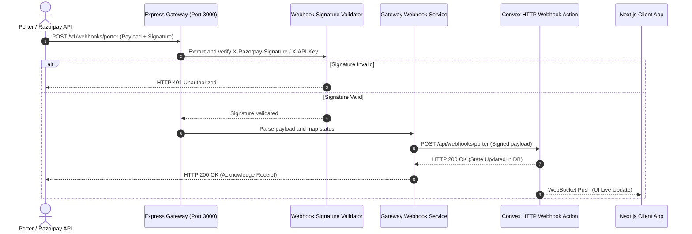

# Hive API Gateway - System Architecture

This document describes the overall system architecture of the Hive API Gateway and maps out the request, response, and webhook lifecycles.

---

## 1. Overall System Architecture

The Hive platform separates core application state, client portals, and external third-party integrations into three distinct layers:
1. **Frontend Portals** (Next.js Apps for Customer, Admin, and Boutique Partner).
2. **Convex Backend** (Acts as the database, serverless schema validator, and core event engine).
3. **Hive API Gateway** (An Express Node.js application running on an Ubuntu VPS, acting as a public proxy and security gateway for webhook ingestions and logistics/payment integrations).



---

## 2. Request & Response Lifecycle

When a client application or an external partner issues a request to the Hive API Gateway, it goes through our centralized request lifecycle:



### Request Phase:
1. **Edge Filter**: The request passes through Cloudflare (for DDoS protection and SSL enforcement) to the target Ubuntu VPS.
2. **Reverse Proxy**: Nginx intercepts the request on port 443, appends the headers (`X-Real-IP`, `X-Forwarded-For`), and proxies it to local port 3000.
3. **Global Middlewares**: Express parses the payload (`express.json()`), compresses the output (`compression`), and adds standard security headers (`helmet`).
4. **Signature Check (Webhooks only)**: The payload is cryptographically validated using HMAC SHA256 against a shared secret to confirm authenticity.
5. **Payload Validation**: The schema-validator middleware compares the request body against standard models.
6. **Controller Mapping**: The clean payload is handed off to the router and matched with a controller.

### Response Phase:
1. **Centralized Error Interceptor**: If any validation, network, or server error occurs, it is thrown as a custom `ApiError` class. The `errorHandler` middleware catches it and maps it to a standard JSON error response:
   ```json
   {
     "error": "Error Message Here",
     "statusCode": 400
   }
   ```
2. **Successful Execution**: The controller responds with an HTTP status code (200, 201) and returns a clean JSON schema.

---

## 3. Webhook Lifecycle

Webhooks from logistics partners (like Porter) or payment processors (like Razorpay) report asynchronous updates about physical transactions (e.g. driver assigned, payment captured). Since these partners cannot establish direct WebSockets to Convex, they ping the Express API Gateway.



### Webhook Verification Process:
* For **Porter**: Validates incoming API keys or signature headers against the server-configured `PORTER_WEBHOOK_SECRET`.
* For **Razorpay**: Recomputes the SHA256 signature using the raw payload body and `RAZORPAY_ROUTE_WEBHOOK_SECRET` and matches it against `x-razorpay-signature` header.
* **Database Sync**: The validated webhook parameters are mapped into a standardized payload and forwarded to Convex HTTP actions, which patch database documents and trigger WebSocket push alerts to partner and client dashboards.
