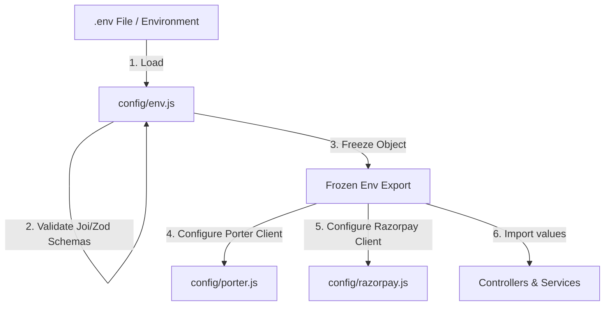

# Hive API Gateway - Configuration & Environment Variables

This document provides a guide to the environment configurations, variables, and client initializers used in the Hive API Gateway.

---

## 1. Configuration Flow

All configurations flow from the environment properties (`.env.local` or OS-level environment variables) through a centralized config validator on startup.

* **Centralized Load**: On initialization, `dotenv` loads the variables. `config/env.js` imports these variables, parses strings into numbers or booleans, and validates them against Joi/Zod schemas.
* **Frozen Constants**: After validation, the configuration object is locked using `Object.freeze()`. This prevents any runtime scripts from modifying system constants.

---

## 2. Environment Variables Manifest

The following variables are required to run the Express API Gateway:

| Variable Name | Type | Description | Security |
| :--- | :--- | :--- | :--- |
| `PORT` | Number | Local port Express runs on (default: `3000`) | Non-sensitive |
| `NEXT_PUBLIC_CONVEX_URL` | String | Public Convex URL (`https://...convex.cloud`) | Non-sensitive |
| `CLERK_SECRET_KEY` | String | Secret key used for authenticating server queries in Convex | **Secret** (Do not share) |
| `RAZORPAY_KEY_ID` | String | Public client key for Razorpay Payment SDK | Non-sensitive |
| `RAZORPAY_KEY_SECRET` | String | Secret key for Razorpay API payment checks | **Secret** |
| `RAZORPAY_ROUTE_WEBHOOK_SECRET` | String | Secret key used to verify HMAC SHA256 webhook signatures | **Secret** |
| `PORTER_WEBHOOK_SECRET` | String | Secret string validated against `x-api-key` in Porter requests | **Secret** |

---

## 3. Secrets Management

* **No Hardcoding**: Secrets (such as API keys and private certificates) must never be hardcoded into the source code files. Instead, they must be references: `process.env.RAZORPAY_KEY_SECRET`.
* **Repository Safety**: The `.env` and `.env.local` files are included in `.gitignore` to prevent secret leaks to remote Git logs. Ensure `.env.example` is maintained up-to-date with dummy values for other engineers onboarding to the team.
