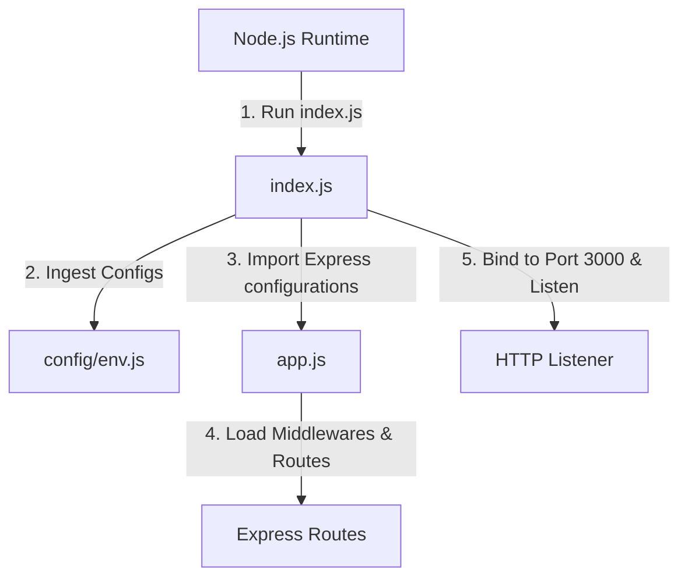
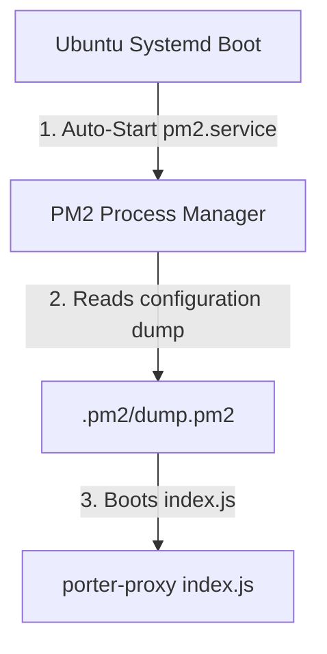

# Hive API Gateway - VPS Deployment Guide

This document describes how the Hive API Gateway is deployed and managed on the live Ubuntu VPS server.

---

## 1. Express Boot & Process Lifecycle

The backend codebase is divided into two entry files to maintain clean separations:
1. **`app.js`**: Configures the Express application routing, registers global middlewares (helmet, compression), and maps route groups. It does **not** bind to a network socket.
2. **`index.js`**: Serves as the server entry point. It imports `app.js`, reads the configurations, binds the port, starts the HTTP listener, and handles process termination events (`SIGTERM`, `SIGINT`).



* **Why is `app.js` separated from `index.js`?**: This separation allows integration tests (e.g. using Supertest) to launch the Express app memory state on a dynamic port without binding to a static network socket, preventing port collision errors during automated test pipelines.

---

## 2. Nginx Reverse Proxy Setup

Nginx acts as a reverse proxy, receiving external HTTPS traffic on port 443 and proxying it to port 3000 on localhost.

### Recommended Nginx Configuration:
```nginx
server {
    listen 8443 ssl http2;
    server_name api.hivenow.in;

    ssl_certificate /etc/letsencrypt/live/api.hivenow.in/fullchain.pem;
    ssl_certificate_key /etc/letsencrypt/live/api.hivenow.in/privkey.pem;

    location / {
        proxy_pass http://127.0.0.1:3000;
        proxy_http_version 1.1;
        
        # Connection and socket settings
        proxy_set_header Upgrade $http_upgrade;
        proxy_set_header Connection 'upgrade';
        proxy_set_header Host $host;
        proxy_cache_bypass $http_upgrade;

        # Forward real client IP headers
        proxy_set_header X-Real-IP $remote_addr;
        proxy_set_header X-Forwarded-For $proxy_add_x_forwarded_for;
        proxy_set_header X-Forwarded-Proto $scheme;
    }
}
```

---

## 3. PM2 Process Management

We use PM2 (Process Manager 2) to keep the Express app running persistently in the background.



### Essential PM2 Commands:
* **Start Application**: Runs the daemonized process under the name `porter-proxy`.
  ```bash
  pm2 start index.js --name porter-proxy
  ```
* **Graceful Reload (Zero-Downtime)**: Re-runs the process in a rolling sequence without dropping active connections.
  ```bash
  pm2 reload porter-proxy
  ```
* **Monitor Logs**: Streams stdout and stderr logs in real-time.
  ```bash
  pm2 logs porter-proxy
  ```
* **Status Checklist**: Displays CPU, memory usage, and process details.
  ```bash
  pm2 show porter-proxy
  ```
* **Save State for Boot**: Dumps the current PM2 list to disk so the services auto-start after server reboots.
  ```bash
  pm2 save
  ```
