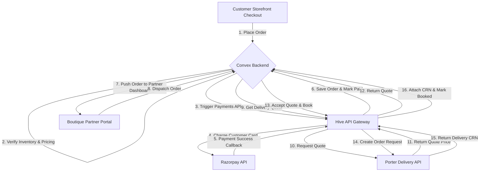
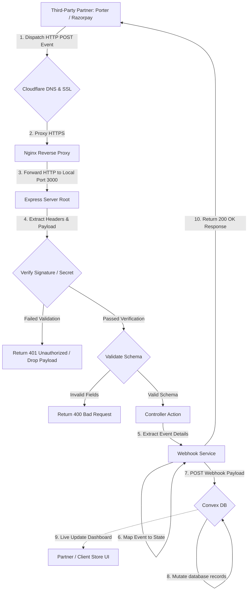
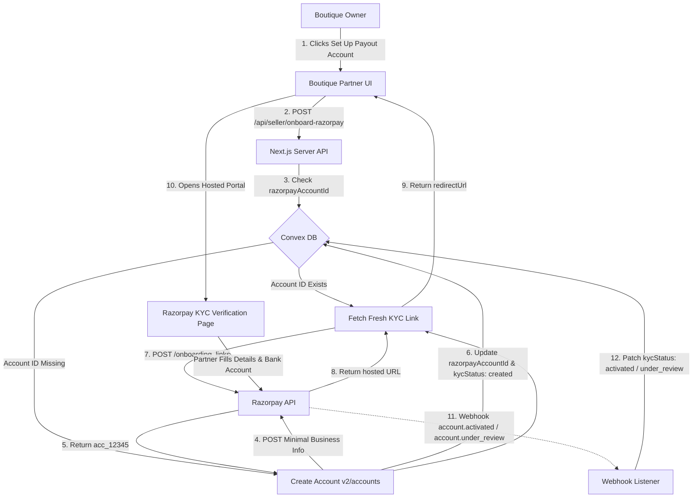
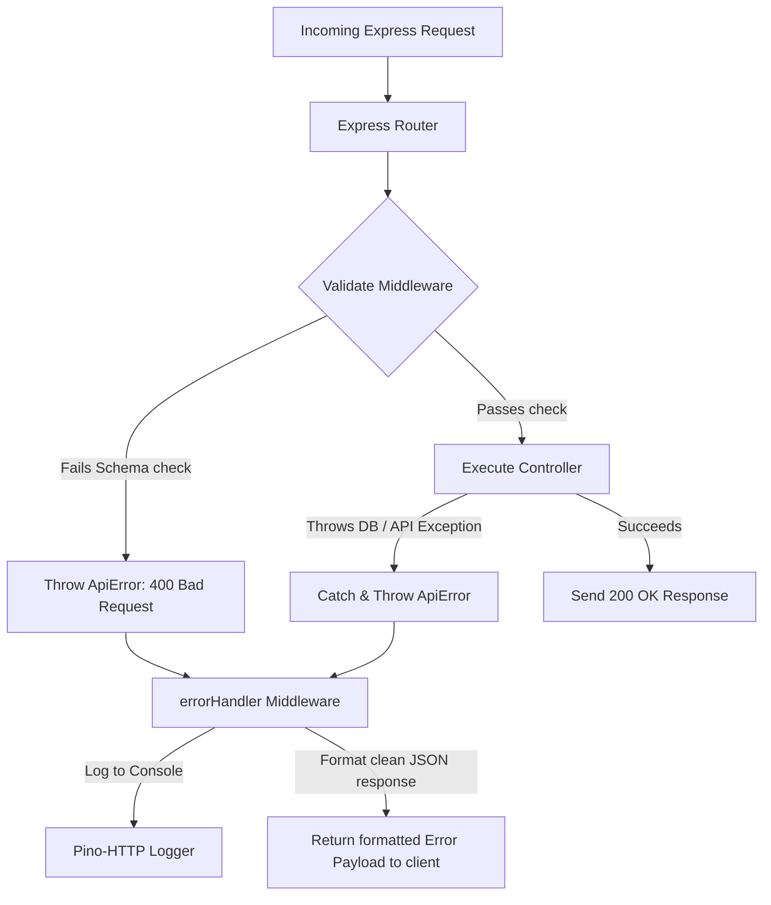

# Hive API Gateway - Flow Diagrams

This document contains flowcharts and sequence maps for all core operations executed within the Hive ecosystem.

---

## 1. Customer Order Creation & Logistics Dispatch

This flowchart outlines the complete path from a checkout click on the customer storefront to the booking of a local delivery agent via the Porter service.

---

## 2. Webhook Event Ingestion Flow

The webhook ingest pipeline ensures that third-party events (like Porter driver movements or Razorpay payouts) are cryptographically verified before touching database states.

---

## 3. Seller Onboarding Flow (Razorpay Hosted KYC)

Instead of collecting banking and personal identity data on our frontend, we use Razorpay's KYC Hosted Portal.

---

## 4. Error Handling & Validation Pipelines

This flowchart describes the path of an incoming Express request failing validation or encountering runtime exceptions.

