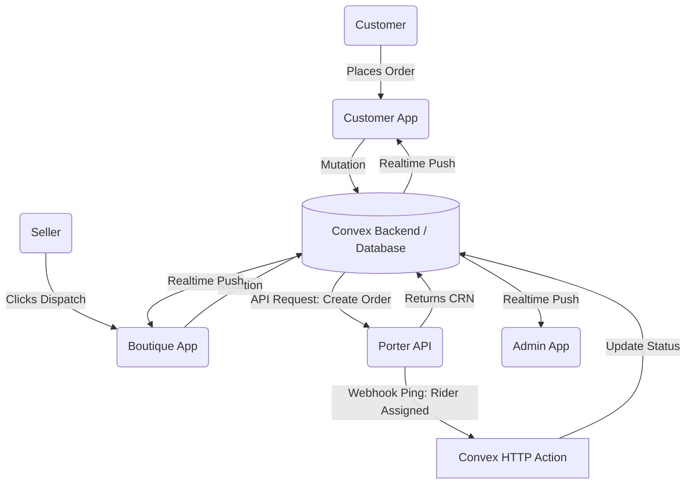
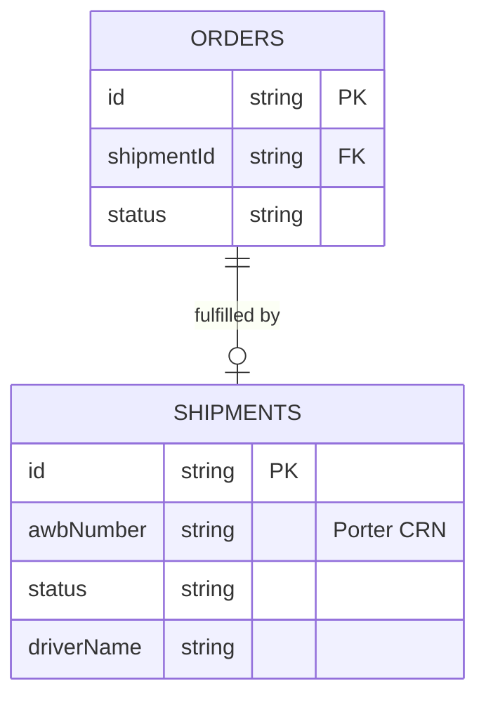
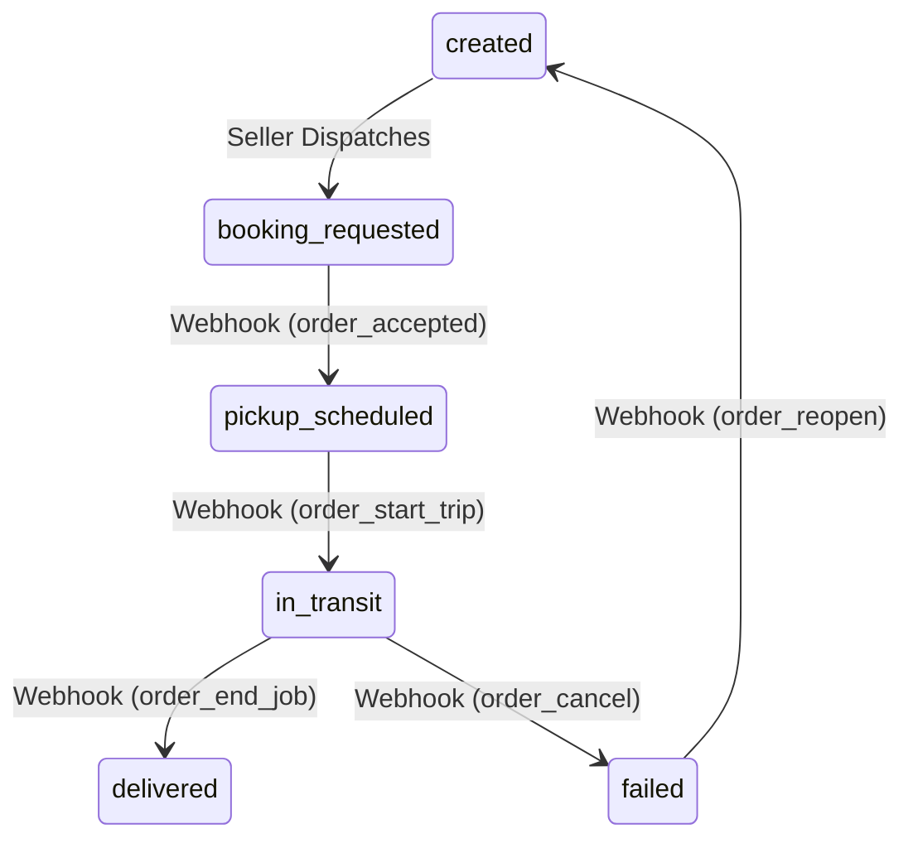
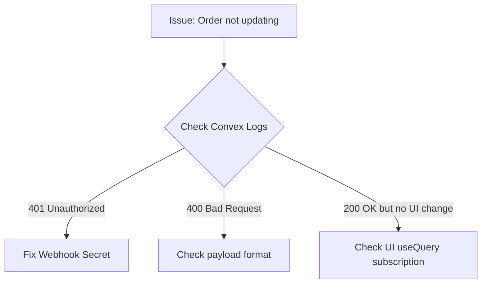

# Hive Engineering Handbook
## Porter Logistics System
### Version 1.0
### Confidential – Hive Engineering Team Only

**Last Updated:** July 2026  
**Prepared By:** Hive Core Engineering Team  

---

# Table of Contents
1. [Chapter 1: Introduction](#chapter-1-introduction)
2. [Chapter 2: System Overview](#chapter-2-system-overview)
3. [Chapter 3: Infrastructure](#chapter-3-infrastructure)
4. [Chapter 4: Repository Structure](#chapter-4-repository-structure)
5. [Chapter 5: Database Architecture](#chapter-5-database-architecture)
6. [Chapter 6: Shipment Lifecycle](#chapter-6-shipment-lifecycle)
7. [Chapter 7: Order Lifecycle](#chapter-7-order-lifecycle)
8. [Chapter 8: Porter Integration](#chapter-8-porter-integration)
9. [Chapter 9: Convex Architecture](#chapter-9-convex-architecture)
10. [Chapter 10: Customer Flow](#chapter-10-customer-flow)
11. [Chapter 11: Seller Flow](#chapter-11-seller-flow)
12. [Chapter 12: Admin Flow](#chapter-12-admin-flow)
13. [Chapter 13: Webhook System](#chapter-13-webhook-system)
14. [Chapter 14: Realtime System](#chapter-14-realtime-system)
15. [Chapter 15: Deployment](#chapter-15-deployment)
16. [Chapter 16: Production Migration](#chapter-16-production-migration)
17. [Chapter 17: Security](#chapter-17-security)
18. [Chapter 18: Monitoring](#chapter-18-monitoring)
19. [Chapter 19: Troubleshooting](#chapter-19-troubleshooting)
20. [Chapter 20: Disaster Recovery](#chapter-20-disaster-recovery)
21. [Chapter 21: Daily Operations](#chapter-21-daily-operations)
22. [Chapter 22: Production Launch Checklist](#chapter-22-production-launch-checklist)
23. [Chapter 23: Appendix](#chapter-23-appendix)

---

# Chapter 1: Introduction

## What is Hive?
Hive is a premium, managed marketplace connecting boutiques and tailors directly with customers. We handle the discovery, payment, and physical logistics required to deliver bespoke and ready-to-wear garments seamlessly. 

## Business Model
Hive charges a platform fee for facilitating transactions between sellers (boutiques) and buyers (customers). A core pillar of our value proposition is offering a completely abstracted, hands-off logistics experience. Sellers focus on creating garments; Hive handles getting the garment to the customer's door.

## Why Logistics Matters
In the premium fashion space, the delivery experience is the final touchpoint with the customer. If logistics fail—if packages are lost, delayed, or un-trackable—the customer blames Hive, not the courier. Robust, transparent, and realtime logistics are critical to maintaining trust and driving repeat purchases.

## Why Porter Was Selected
Porter offers on-demand, hyper-local delivery services with robust API support. Their infrastructure allows for programmatic booking, instant driver assignment, and realtime webhook updates. This enables Hive to completely automate the delivery process without manual operational overhead.

## Purpose of this Handbook
This handbook is the definitive, permanent engineering record for the Hive Logistics System. It serves as the primary onboarding and operational manual for all engineering and operations staff.

## Target Audience
This document is written for Backend Developers, Frontend Developers, DevOps Engineers, Operations Teams, and Future Founders. It assumes no prior knowledge of the Hive codebase.

---

# Chapter 2: System Overview

## High Level Architecture
The Hive logistics system is entirely serverless. It operates by coordinating state across three independent Next.js frontend applications and a unified Convex backend.

When a customer orders a garment, the seller triggers a dispatch from their dashboard. The Convex backend securely calls the Porter API to book a rider. As the rider moves, Porter sends asynchronous webhooks back to Convex. Convex updates the database and instantly pushes these updates via WebSockets to all connected UIs.



### Components Explained
- **Customer App:** A Next.js application where buyers track their orders.
- **Boutique App:** A Next.js application where sellers manage and dispatch orders.
- **Admin App:** A Next.js application where Hive operators monitor system health and resolve exceptions.
- **Convex Backend:** The serverless database, API layer, and webhook receiver.
- **Porter API:** The external logistics provider managing physical drivers.

---

# Chapter 3: Infrastructure

The following infrastructure components are confirmed in the architecture. 

## Convex
- **Purpose:** Serverless backend, database, and real-time synchronization engine.
- **Responsibilities:** Storing shipments, authenticating users, executing API calls to Porter, receiving webhooks, and pushing WebSocket updates.
- **Security:** Requires environment variables for external access. Webhooks use constant-time signature comparison.
- **Communication:** Speaks HTTPS to Porter and WebSockets to Next.js clients.

## Next.js (Customer, Boutique, Admin)
- **Purpose:** React frameworks rendering the UIs.
- **Responsibilities:** Presenting data and dispatching user intents to Convex.

> [!WARNING]
> ## Deployment Information Required
> The supplied architecture documents do not provide information on the following components. Do not guess these configurations.
> - **Express Server:** Not present in the architecture.
> - **Nginx Config:** Required.
> - **PM2 Config:** Required.
> - **Cloudflare Settings:** Required.
> - **Domains:** Required.
> - **SSL Configuration:** Required.

---

# Chapter 4: Repository Structure

The logistics integration spans across the `convex/` backend folder and `apps/` frontend workspaces.

```mermaid
graph TD
    Root[Hive Repository]
    Root --> Convex[convex/]
    Root --> Apps[apps/]
    
    Convex --> Lib[lib/porter.ts]
    Convex --> Webhooks[webhooks/porter.ts]
    Convex --> AdminLog[adminLogistics.ts]
    Convex --> Orders[orders.ts]
    Convex --> Schema[schema.ts]
    
    Apps --> Customer[customer/src/app/orders/[orderId]/page.tsx]
    Apps --> Boutique[boutique/src/app/boutique/orders/page.tsx]
    Apps --> Admin[admin/src/app/admin/logistics/]
```

### File Details

| File Path | Purpose | Responsibilities | Calls / Called By |
|---|---|---|---|
| `convex/lib/porter.ts` | Porter SDK | API interaction (quotes, booking, tracking) | Called by dispatch mutations and webhooks. |
| `convex/webhooks/porter.ts` | Webhook Receiver | Validates signature, parses payload, triggers DB updates. | Called by Porter HTTP POST. Calls `adminLogistics.ts`. |
| `convex/adminLogistics.ts` | State Machine | Processes logistics status updates safely. | Called by Webhooks and Admin UI. |
| `convex/orders.ts` | Order Management | Creates shipments and shapes order data for clients. | Called by all three UIs. |
| `convex/schema.ts` | Database Definitions | Defines `shipments` collection and indexes. | N/A |

---

# Chapter 5: Database Architecture

Hive uses Convex as its NoSQL datastore.

## Why Shipment is the Single Source of Truth
In distributed logistics, data duplication causes race conditions. If an order and a shipment both store the "tracking status", they will eventually fall out of sync. Hive strictly stores all physical tracking data on the `shipments` collection. The `orders` collection merely holds a reference (`shipmentId`). All queries map the shipment data into the order at runtime.

## The `shipments` Collection

**Purpose:** Tracks the physical movement of a package.

| Field | Type | Description |
|---|---|---|
| `_id` | `Id("shipments")` | Internal Convex ID. |
| `orderId` | `Id("orders")` | The purchase this shipment fulfills. |
| `awbNumber` | `string` | The Porter CRN (Customer Reference Number). Used for webhook lookup. |
| `status` | `string` | The current state (e.g., `pickup_scheduled`, `delivered`). |
| `driverName` | `string` | Driver's full name. |
| `liveTrackingUrl` | `string` | Public URL for map tracking. |
| `rawWebhookEvents` | `Array` | Append-only log of every ping from Porter. |

## Indexes
Indexes allow Convex to find records in `O(1)` time. 

- **`by_awbNumber`**: `["awbNumber"]`. This is the most critical index. When Porter sends a webhook, they only send the `order_id` (CRN). This index allows the webhook to instantly find the correct shipment to update.
- **`by_orderId`**: `["orderId"]`. Used to join orders and shipments.
- **`by_status`**: `["status"]`. Used by the Admin queue to find active or failed shipments.



---

# Chapter 6: Shipment Lifecycle

A shipment moves through a strict, unidirectional state machine.



## Step-by-Step Breakdown

1. **Created:** 
   - **Trigger:** Seller clicks "Mark as Packed".
   - **Database:** Blank shipment row created.
2. **Booking Requested:**
   - **Trigger:** Seller clicks "Dispatch". `createOrder` called.
   - **Database:** `awbNumber` populated with Porter CRN.
3. **Pickup Scheduled:**
   - **Trigger:** Porter webhook `order_accepted`.
   - **Database:** Status becomes `pickup_scheduled`. `driverName` and `liveTrackingUrl` are fetched and saved.
4. **In Transit:**
   - **Trigger:** Porter webhook `order_start_trip`.
   - **Database:** Status becomes `in_transit`.
5. **Delivered:**
   - **Trigger:** Porter webhook `order_end_job`.
   - **Database:** Status becomes `delivered`. Order is marked completed.

---

# Chapter 7: Order Lifecycle

The order lifecycle wraps the shipment lifecycle. 

1. **Checkout:** Customer selects items. `orders` row created as `pending_payment`.
2. **Payment:** Razorpay confirms funds. Order moves to `confirmed`.
3. **Fulfillment:** Seller triggers shipment lifecycle (see Chapter 6).
4. **Delivery:** When Shipment reaches `delivered`, the `orders` row mirrors the completion.

**Database Writes:**
- `insert("orders")` at checkout.
- `patch("orders")` at payment.
- `insert("shipments")` at dispatch.

---

# Chapter 8: Porter Integration

All external API interactions are isolated in `convex/lib/porter.ts`. 

## API Definitions

### 1. Create Order
- **Purpose:** Books a physical driver to move a package.
- **Endpoint:** `POST /v1/orders/create`
- **Authentication:** `x-api-key` header.
- **Payload:** Pickup address, delivery address, and an idempotency key (`request_id`).
- **Response:** Returns the CRN (`order_id`).
- **Error Handling:** Throws standard Error. Transaction aborts.

### 2. Get Order Details
- **Purpose:** Fetches driver names and map URLs that are missing from webhook payloads.
- **Endpoint:** `GET /v1/orders/:crn`
- **Where Used:** Inside the webhook handler during `order_accepted`.

---

# Chapter 9: Convex Architecture

Convex is a reactive backend. 

- **Queries:** Read-only functions that automatically subscribe to the database. If the data changes, Convex pushes the new result to the client.
- **Mutations:** Write functions. They are ACID compliant. If a mutation fails, it rolls back entirely.
- **Internal Actions:** Server-side functions that can call external APIs (like Porter) without being exposed to the public internet.
- **HTTP Actions:** Standard REST endpoints used for receiving Webhooks.

---

# Chapter 10: Customer Flow

**The Journey:**
1. Customer visits `apps/customer/src/app/orders/[orderId]/page.tsx`.
2. Component calls `useQuery(api.orders.getOrderByIdInternal)`.
3. The page renders the `TrackingTimeline`.
4. The timeline dynamically maps the Convex `status` to UI steps (e.g., "Partner Confirmation" -> "Rider Assigned" -> "Dispatched").
5. The `DriverTrackingCard` displays the Rider's Name, Phone, and ETA.

**Resilience:**
If `driverName` is null (which happens during UAT testing before a rider accepts), the `DriverTrackingCard` returns `null` and hides itself gracefully to prevent breaking the UI.

---

# Chapter 11: Seller Flow

**The Journey:**
1. Seller opens `apps/boutique/src/app/boutique/orders/page.tsx`.
2. Seller clicks "Dispatch".
3. Frontend triggers `readyForPickup` mutation.
4. Backend executes `createOrder` via Porter SDK.
5. The UI automatically updates to show the Provider (Porter) and Booking ID (CRN).
6. Once the webhook assigns a driver, the Seller UI dynamically renders the Rider Information card (Name, Phone, Vehicle) directly below the Booking ID.

---

# Chapter 12: Admin Flow

**The Journey:**
1. Admin visits `apps/admin/src/app/admin/logistics/[id]/ShipmentDetailsClient.tsx`.
2. Admin views the "Rider Assignment" card containing comprehensive driver data.
3. Below the rider card, the "Tracking Event History" component maps over `shipment.rawWebhookEvents`. 
4. This renders a precise, timestamped audit log of every ping Porter has ever sent for this shipment.

**Operations:**
If a shipment fails (e.g., `order_cancel`), an exception card appears allowing the Admin to initiate a return or re-attempt.

---

# Chapter 13: Webhook System

Webhooks are how Porter informs Hive of physical world events.

## Authentication & Security
When a webhook hits `convex/webhooks/porter.ts`, it includes an `x-api-key` header.
Hive uses a `constantTimeCompare` function to check this key against `process.env.PORTER_WEBHOOK_SECRET`. Constant time comparison prevents attackers from guessing the secret by measuring response times.

## Processing Flow
1. **Receive:** Webhook endpoint receives JSON.
2. **Validate:** Signature checked. Fails with 401 if invalid.
3. **Map:** `order_accepted` maps to `pickup_scheduled`.
4. **Enrich:** If `order_accepted`, Convex reaches out to Porter `GET /v1/orders/:crn` to grab missing driver details.
5. **Update:** Dispatches a background mutation (`processLogisticsStatusUpdateInternal`) using the `awbNumber` index to patch the database.
6. **Acknowledge:** Returns `200 OK` to Porter within 15 seconds to prevent retries.

---

# Chapter 14: Realtime System

Hive does not use polling (e.g., `setInterval` to fetch data every 5 seconds). 

## How It Works
1. Next.js calls `useQuery`.
2. Convex opens a WebSocket connection.
3. When the Porter Webhook patches the `shipments` table, the Convex database engine detects the change.
4. Convex identifies all active WebSocket connections querying that shipment.
5. Convex pushes the exact diff to the Customer, Seller, and Admin UIs.
6. React re-renders instantly.

---

# Chapter 15: Deployment

> [!WARNING]
> ## Deployment Information Required
> The supplied architecture documents do not provide deployment steps, rollback procedures, or CI/CD pipeline structures. Do not guess these configurations.
> Please update this section when server manifests and deployment procedures are provided.

---

# Chapter 16: Production Migration

To move from UAT (Sandbox) to Production, the following changes are strictly required:

| Component | Action Required |
|---|---|
| `PORTER_API_URL` | Ensure this points to Porter's live production URL. |
| `PORTER_API_KEY` | Swap the Sandbox key for the Live key in Convex Dashboard. |
| `PORTER_WEBHOOK_SECRET` | Must be a secure UUID. The system is programmed to **fail closed** if the secret is set to `mock_secret` while `NODE_ENV === "production"`. |
| Webhook Dashboard | You must log into the Porter partner dashboard and register `https://<your-prod>.convex.site/webhooks/porter`. |

---

# Chapter 17: Security

- **Webhook Security:** Webhooks require the `x-api-key` header.
- **Fail Closed:** If the webhook secret is missing, or set to a mock value in production, the webhook route returns a 500 error and refuses to process data.
- **API Keys:** Never committed to source control. Managed exclusively through the Convex Environment Variables dashboard.
- **Data Integrity:** `processLogisticsStatusUpdateInternal` enforces a valid state machine to prevent malicious or out-of-order webhooks from corrupting shipment statuses.

---

# Chapter 18: Monitoring

> [!WARNING]
> ## Deployment Information Required
> The supplied architecture documents do not detail external monitoring tools like PM2, Datadog, Sentry, or health check endpoints.
> Convex provides internal logging within the Convex Dashboard for background mutation failures.

---

# Chapter 19: Troubleshooting

### Webhook Failed / Not Updating
1. **Symptom:** Porter app shows picked up, Hive UI shows waiting.
2. **Check:** Convex Logs for the `handlePorterWebhook` action. 
3. **Fix:** Ensure `PORTER_WEBHOOK_SECRET` matches Porter dashboard.

### Missing Rider Details
1. **Symptom:** UI says "Waiting for Porter to assign a rider" but a rider is assigned.
2. **Check:** Did the `syncOrderDetails` action fail? 
3. **Fix:** Check `PORTER_API_KEY` validity.



---

# Chapter 20: Disaster Recovery

### Porter Downtime
If Porter's API goes down, `createOrder` throws an error. The Seller UI will display an alert. The shipment remains in `created` state. Sellers must retry later.

### Convex Downtime
If Convex goes down, webhooks will bounce. Porter automatically retries webhooks on an exponential backoff schedule. Once Convex recovers, it will process the queued webhooks idempotently.

---

# Chapter 21: Daily Operations

**Morning Checklist:**
- Open Admin Logistics Control Tower.
- Filter by `status === "failed"`.
- Resolve any driver cancellations or RTOs manually.

**Weekly Checklist:**
- Audit `rawWebhookEvents` for anomalies (e.g., shipments stuck in `in_transit` for > 48 hours).

---

# Chapter 22: Production Launch Checklist

- [ ] Ensure `PORTER_API_URL` is production.
- [ ] Ensure `PORTER_API_KEY` is production.
- [ ] Generate secure UUID for `PORTER_WEBHOOK_SECRET`.
- [ ] Register Convex webhook URL in Porter Dashboard.
- [ ] Perform one end-to-end live test order.
- [ ] Verify Admin Control Tower receives webhooks.
- [ ] Verify Customer UI tracks driver accurately.

---

# Chapter 23: Appendix

### Collections
- `shipments`
- `orders`

### Status Values (Shipments)
- `created`
- `booking_requested`
- `pickup_scheduled`
- `in_transit`
- `delivered`
- `failed`
- `cancelled`

### Webhook Endpoint
`POST /webhooks/porter`

### Glossary
- **CRN:** Customer Reference Number (Porter's `order_id`).
- **Idempotency:** The property of an operation that can be applied multiple times without changing the result beyond the initial application.
- **UAT:** User Acceptance Testing.

---
**End of Document**
