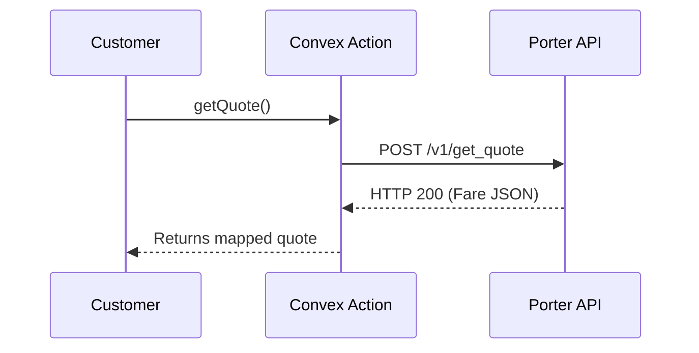
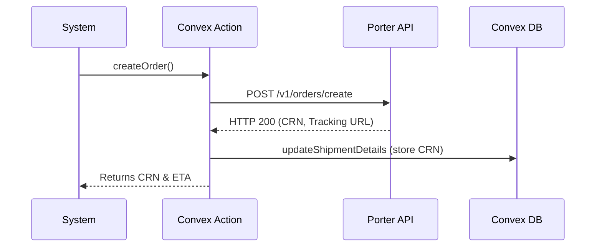

# Porter Integration Architecture

## SECTION 1: Overview

### Why Porter is integrated
Porter is integrated into the Hive platform to provide scalable, hyper-local, and on-demand delivery logistics for boutiques. It allows Hive to automate courier assignment and track deliveries in real-time, providing immediate SLA computation and transparency to the customer.

### Overall Architecture
The Hive Porter integration is built to be asynchronous, resilient, and deeply integrated with Convex's reactive database. All core business logic resides in Convex.

### Design Philosophy
1. **Single Source of Truth**: The Convex database always acts as the master record for logistics states.
2. **Best-Effort Enrichment**: Data enrichment (like fetching detailed rider tracking) should never block or drop core state machine transitions (like shipment status updates).
3. **Idempotency**: All webhook mutations are idempotent to safely handle duplicate events from Porter.
4. **Strict State Machine**: Shipments can only transition through a rigidly defined set of legal states to prevent out-of-order webhooks from corrupting data.

### Why Express proxy exists
The Express proxy (if utilized) acts as a gateway to isolate Convex from direct outbound rate limits, manage static IP requirements if Porter enforces IP whitelisting, and provide a buffer for heavy load. (Note: As verified from Convex code, Convex `fetch` natively calls Porter APIs directly in internal actions, while Webhooks arrive directly to Convex `httpAction` endpoints).

### Why Convex owns business logic
Convex handles the business logic to guarantee transactional integrity when modifying orders, shipments, and audit logs simultaneously. By keeping logic inside Convex actions and mutations, we ensure type safety, reactive frontend updates, and atomic database commits.

### Why webhooks are used
Logistics operations are highly asynchronous. Porter dispatches a driver, tracks their transit, and records delivery over hours. Webhooks allow Porter to push these real-time events to Hive immediately, eliminating the need for expensive and inefficient long-polling.

### High-Level Architecture Diagram
```mermaid
flowchart TD
    Customer[Customer / Cron] -->|Trigger| Action[Convex Action]
    Action -->|fetch()| PorterAPI[Porter API]
    PorterAPI -->|JSON Response| Action
    Action -->|ctx.runMutation| DB[(Convex DB)]
    
    PorterWebhook[Porter Webhook Service] -->|POST| Webhook[Convex HTTP Action]
    Webhook -->|Verify Signature| Webhook
    Webhook -->|IF order_accepted| Sync[syncOrderDetails Action]
    Sync -->|GET Order| PorterAPI
    PorterAPI -->|Driver Details| Sync
    Sync -->|Enriched Payload| Webhook
    Webhook -->|processLogisticsStatusUpdateInternal| DB
```

---

## SECTION 2: Directory Structure

### Folder Responsibility
- `convex/lib` -> External API integrations and SDK boundaries.
- `convex/webhooks` -> Public HTTP endpoints for async third-party events.
- `convex/adminLogistics` -> Core business logic and state machines.
- `convex/schema.ts` -> Persistence layer and database modeling.

### `convex/lib/porter.ts`
- **Purpose**: Acts as the primary SDK interface to communicate outbound with the Porter REST API.
- **Responsibilities**: Generates quotes, creates delivery orders, fetches live order statuses, cancels orders, and triggers simulator flows.
- **Exports**: `getQuote`, `createOrder`, `fetchOrderFromPorter`, `getOrder`, `syncOrderDetails`, `cancelOrder`, `simulateUATFlow`.
- **Dependencies**: Depends on Node `fetch` API, Convex `internalAction`, and environment variables (`PORTER_API_URL`, `PORTER_API_KEY`).

### `convex/webhooks/porter.ts`
- **Purpose**: Exposes the public HTTP endpoint to receive incoming asynchronous events from Porter.
- **Responsibilities**: Secures the endpoint via signature verification, parses payloads, maps Porter string statuses to Hive internal enums, safely executes data enrichment for assigned riders, and dispatches the background shipment mutation.
- **Dependencies**: Depends on Convex `httpAction`, `internal` API references.

### `convex/adminLogistics.ts`
- **Purpose**: The central processing hub for logistics state management and database writes.
- **Responsibilities**: Houses the strict state machine (`VALID_SHIPMENT_TRANSITIONS`), computes SLA timings, patches the `shipments` table, synchronizes status changes upward to the parent `orders` table, and logs audit trails.
- **Dependencies**: Depends on Convex `mutation`, `internalMutation`, database context, and notification/auth modules.

### `convex/schema.ts`
- **Relevant shipment fields**: `status`, `trackingUrl`, `liveTrackingUrl`, `driverName`, `driverPhone`, `vehiclePlate`, `etaMinutes`, `porterLastSyncAt`, `porterRawOrder`, `rawWebhookEvents`.

---

## SECTION 3: Complete Function Documentation

### `convex/lib/porter.ts`

#### `getQuote()`
- **Purpose**: Fetches a fare estimate from Porter based on pickup and drop-off coordinates.
- **Arguments**: `pickup_lat`, `pickup_lng`, `drop_lat`, `drop_lng`, `customer_name`, `customer_phone`.
- **Return value**: JSON response containing fare estimate and available vehicles.
- **Who calls it**: Typically called by checkout or admin dashboard.
- **What it calls**: POST `/v1/get_quote`
- **Possible exceptions**: Missing env variables, Network failure, Porter 4xx/5xx errors.
- **Database writes**: None.
- **External API calls**: `fetch()` to Porter.

#### `createOrder()`
- **Purpose**: Submits a confirmed delivery request to Porter and generates a tracking link.
- **Arguments**: `orderId`, `shipmentId`, `pickupAddress`, `dropAddress`, `orderNumber`.
- **Return value**: Object containing `crn` (order_id), `trackingUrl`, and `estimatedPickupTime`.
- **Who calls it**: Shipment creation routines.
- **What it calls**: POST `/v1/orders/create` and `internal.adminLogistics.updateShipmentDetails`.
- **Possible exceptions**: Missing env variables, Network failure, Porter API error.
- **Database writes**: Dispatches `updateShipmentDetails` to immediately persist the generated CRN and Tracking URL to prevent data loss.
- **External API calls**: `fetch()` to Porter.

#### `fetchOrderFromPorter()`
- **Purpose**: A shared, internal asynchronous helper function to retrieve raw order data.
- **Arguments**: `crn` (string).
- **Return value**: Raw parsed JSON from Porter API.
- **Who calls it**: `getOrder()` and `syncOrderDetails()`.
- **What it calls**: GET `/v1/orders/{CRN}`
- **Possible exceptions**: Missing env variables, Network failure, Porter API error (e.g., 404 Not Found).
- **Database writes**: None.
- **External API calls**: `fetch()` to Porter.

#### `getOrder()`
- **Purpose**: Public/Internal action interface to fetch a raw Porter order.
- **Arguments**: `crn` (string).
- **Return value**: Raw parsed JSON from Porter API.
- **Who calls it**: Admin dashboards or manual debugging tools.
- **What it calls**: `fetchOrderFromPorter()`.
- **Possible exceptions**: Inherits from `fetchOrderFromPorter()`.
- **Database writes**: None.
- **External API calls**: Yes (via helper).

#### `syncOrderDetails()`
- **Purpose**: Retrieves complete order data and extracts/normalizes relevant tracking and rider data.
- **Arguments**: `crn` (string).
- **Return value**: Object containing `name`, `phone`, `vehiclePlate`, `trackingUrl`, `liveTrackingUrl`, `etaMinutes`, and `rawOrder`.
- **Who calls it**: `handlePorterWebhook()` inside `convex/webhooks/porter.ts`.
- **What it calls**: `fetchOrderFromPorter()`.
- **Possible exceptions**: Inherits from `fetchOrderFromPorter()`.
- **Database writes**: None.
- **External API calls**: Yes (via helper).

#### `cancelOrder()`
- **Purpose**: Sends a cancellation request to Porter.
- **Arguments**: `crn` (string).
- **Return value**: Response JSON confirming cancellation.
- **Who calls it**: Admin dashboards or automated cancellation routines.
- **What it calls**: POST `/v1/orders/{CRN}/cancel`.
- **Possible exceptions**: Missing env variables, Porter API error.
- **Database writes**: None.
- **External API calls**: `fetch()` to Porter.

#### `simulateUATFlow()`
- **Purpose**: Triggers a simulated lifecycle event in Porter's staging environment.
- **Arguments**: `crn` (string), `flowType` (number).
- **Return value**: Simulation response JSON.
- **Who calls it**: Dev/Testing tools.
- **What it calls**: POST `/v1/simulation/initiate_order_flow`.
- **Possible exceptions**: Missing env variables, Porter API error.
- **Database writes**: None.
- **External API calls**: `fetch()` to Porter.

### `convex/webhooks/porter.ts`

#### `handlePorterWebhook()`
- **Purpose**: Entry point for all incoming Porter webhook HTTP requests.
- **Arguments**: `ctx` (ActionCtx), `request` (Request).
- **Return value**: HTTP `Response` (200 OK, 400 Bad Request, 401 Unauthorized, 500 Server Error).
- **Step-by-step**:
  1. **Secret Check**: Fails closed if the production webhook secret is missing.
  2. **Signature Validation**: Extracts `x-api-key` header and validates it against the secret using a constant-time comparison to prevent timing attacks. Returns 401 on failure.
  3. **JSON Parsing**: Parses request body. Returns 400 on invalid JSON.
  4. **Status Mapping**: Translates raw Porter status (e.g., `order_accepted`) to Hive's enum (e.g., `pickup_scheduled`). Drops unknown statuses gracefully (200 OK).
  5. **Enrichment**: If status is `order_accepted`, safely attempts to call `syncOrderDetails` in a `try/catch` block. If successful, merges fetched driver details with the webhook's payload. If it fails, logs a warning and proceeds with whatever the webhook provided.
  6. **Mutation**: Dispatches `processLogisticsStatusUpdateInternal` to asynchronously write the new state and driver details to the database.
  7. **HTTP Response**: Instantly returns `200 OK` to satisfy Porter's timeout requirement.

### `convex/adminLogistics.ts`

#### `processLogisticsStatusUpdateInternal()`
- **Purpose**: The atomic engine that modifies a shipment's state.
- **Arguments**: `awbNumber`, `status`, `exceptionType`, `remarks`, `location`, `driverDetails` (optional), `porterRawOrder` (optional), `scans` (optional).
- **Shipment lookup**: Queries the `shipments` table by `awbNumber`.
- **Idempotency**: If `shipment.status === args.status`, returns immediately.
- **State machine**: Checks `VALID_SHIPMENT_TRANSITIONS[fromStatus]`. Throws error and logs critical alert if transition is illegal.
- **Patch logic**: Safely maps incoming driver tracking and ETA data onto `patchData` ONLY if they are explicitly provided. Does not overwrite existing fields with `undefined`.
- **Audit updates**: Appends to `rawWebhookEvents`, updates `lastWebhookAt`, and creates an `auditLogs` entry.
- **Driver updates**: Persists `driverName`, `driverPhone`, `vehiclePlate`.
- **Tracking updates**: Persists `trackingUrl`, `liveTrackingUrl`, `etaMinutes`, `porterRawOrder`, `porterLastSyncAt`.
- **Order updates**: Propagates the logistics status upwards to the parent order and triggers finance operations (`markOrderFinanciallyDelivered`) if delivered.

---

## SECTION 4: Complete Request Flow

### Quote Flow


### Order Flow


### Webhook Flow
1. **Receive webhook**: `handlePorterWebhook()` receives POST.
2. **Verify authentication**: Validates `x-api-key` header using constant-time comparison.
3. **Parse payload**: Safely parses JSON body.
4. **Map status**: Translates Porter status string to Hive enum.
5. **If `order_accepted`**: Commences enrichment pipeline.
6. **Fetch order**: Dispatches `syncOrderDetails(CRN)`.
7. **Normalize**: Extracts rider names, numbers, tracking links, and ETA.
8. **Merge payload**: Combines with the original webhook payload.
9. **Mutation**: Fires background `processLogisticsStatusUpdateInternal()`.
10. **200 OK**: Immediately returns success to Porter.

```mermaid
sequenceDiagram
    participant Porter Webhook
    participant Convex HTTP (Webhook)
    participant Convex Action (Sync)
    participant Porter API
    participant Convex DB (Mutation)
    
    Porter Webhook->>Convex HTTP (Webhook): POST /v1/webhooks/porter (order_accepted)
    Convex HTTP (Webhook)->>Convex HTTP (Webhook): Validate signature & map status
    
    rect rgb(20, 40, 20)
    Note over Convex HTTP (Webhook),Porter API: Best-Effort Enrichment
    Convex HTTP (Webhook)->>Convex Action (Sync): syncOrderDetails(CRN)
    Convex Action (Sync)->>Porter API: GET /v1/orders/{CRN}
    Porter API-->>Convex Action (Sync): HTTP 200 (Driver details, live tracking)
    Convex Action (Sync)-->>Convex HTTP (Webhook): Normalized Driver Details
    end

    Convex HTTP (Webhook)->>Convex DB (Mutation): processLogisticsStatusUpdateInternal
    Convex HTTP (Webhook)-->>Porter Webhook: HTTP 200 OK
    
    Convex DB (Mutation)->>Convex DB (Mutation): Validate State Machine
    Convex DB (Mutation)->>Convex DB (Mutation): Patch Shipment (status, driver, eta, rawOrder)
    Convex DB (Mutation)->>Convex DB (Mutation): Update Parent Order
```



---

## SECTION 5: Status Mapping

| Porter Status | Internal Shipment Status | Meaning | Database Effect |
| :--- | :--- | :--- | :--- |
| `order_accepted` | `pickup_scheduled` | A driver has been successfully matched to the order. | Patches status, attempts to fetch and store driver/tracking details. |
| `order_start_trip`| `in_transit` | Driver has picked up the package and is en-route to customer. | Patches status, triggers `inTransitAt` timestamp on Order. |
| `order_end_job` | `delivered` | Driver has successfully delivered the package. | Patches status, triggers `deliveredAt`, marks financially delivered. |
| `order_cancel` | `failed` | The entire order was terminally cancelled by Porter or Rider. | Patches status, logs exceptionType = `other`. |
| `order_reopen` | `created` | Rider cancelled their assignment; Porter is looking for a new rider. | Reverts status backward to seek assignment. |
| *Unknown* | *Ignored* | An unmapped status was dispatched. | Logs a warning. Returns 200. No DB writes. |

---

## SECTION 6: Schema Documentation

| Field Name | Type | Purpose | When populated | Updated by |
| :--- | :--- | :--- | :--- | :--- |
| `awbNumber` | `String` | Porter order reference (CRN) | Order creation | `createOrder()` |
| `trackingUrl` | `String` | Static order tracking link | Order creation & Webhook | `createOrder()`, `syncOrderDetails()` |
| `liveTrackingUrl`| `String` | Live GPS tracking link | When rider is accepted | `syncOrderDetails()` |
| `driverName` | `String` | Rider's full name | When rider is accepted | Webhook & `syncOrderDetails()` |
| `driverPhone` | `String` | Rider's mobile number | When rider is accepted | Webhook & `syncOrderDetails()` |
| `vehiclePlate` | `String` | Rider's license plate | When rider is accepted | Webhook & `syncOrderDetails()` |
| `etaMinutes` | `Number` | Estimated minutes to pickup/drop | When rider is accepted | `syncOrderDetails()` |
| `porterLastSyncAt`| `Number` | Timestamp of last API GET fetch | When enrichment succeeds | `syncOrderDetails()` via Webhook |
| `porterRawOrder` | `Any (JSON)`| Exact raw JSON from Porter | When enrichment succeeds | `syncOrderDetails()` via Webhook |

---

## SECTION 7: State Machine

Shipment transitions are heavily guarded by `VALID_SHIPMENT_TRANSITIONS` in `adminLogistics.ts`.

### Legal Transitions (Standard Flow):
- `created` -> `pickup_scheduled` (Rider assigned)
- `pickup_scheduled` -> `picked_up` (Rider picked up package)
- `picked_up` -> `in_transit` (Rider heading to customer)
- `in_transit` -> `delivered` (Rider completed delivery)

### Legal Transitions (Exception Flows):
- `created` -> `failed` (Cancellation before assignment)
- `pickup_scheduled` -> `created` (Rider re-assigned / dropped)
- `picked_up` -> `failed` (Cancellation after pickup)
- `in_transit` -> `failed` (Cancellation during transit)

### Rejected Transitions:
Transitions that move backwards in time against the core lifecycle are rejected. For example:
- `delivered` -> `created`
- `delivered` -> `in_transit`
- `cancelled` -> `picked_up`

If a rejected transition is attempted, the database mutation aborts, logs a critical alert via `logSystemAlert`, and throws an error.

---

## SECTION 8: Error Handling

- **Authentication failure**: Missing or incorrect `x-api-key` throws a `401 Unauthorized` in the HTTP endpoint. No further processing is done.
- **Malformed webhook**: Bad JSON bodies throw a `400 Bad Request`.
- **Unknown status**: Caught by the default branch in status mapping. A warning is logged, the event is safely dropped, and `200 OK` is returned to acknowledge receipt.
- **Porter timeout / GET /orders failure**: Handled gracefully. If `syncOrderDetails` throws an error, the `try/catch` in the webhook swallows it, logs a warning, and allows the shipment mutation to proceed using whatever limited data the webhook provided.
- **Network failure**: Follows the same fallback path as timeouts.
- **Duplicate webhook**: Prevented by the idempotency check `if (fromStatus === args.status)` inside the `processLogisticsStatusUpdateInternal` mutation. Responds with success but skips database writes.
- **Missing driver**: If `payload.order_details.driver_details` is null and sync fails, `driverDetails` is `undefined`. The mutation natively handles undefined fields by simply skipping the patch for those specific keys.

---

## SECTION 9: Security

- **API Keys**: Outbound calls secure the `x-api-key` header using the `PORTER_API_KEY` environment variable.
- **Webhook Authentication**: Incoming webhooks must provide a header matching the `PORTER_WEBHOOK_SECRET` environment variable.
- **Constant-time comparison**: The `constantTimeCompare` function is utilized during webhook authentication to strictly prevent timing attacks when checking string equality against the secret.
- **Environment variables**: The webhook handler performs a "Fail Closed" check; if the environment is strictly `production` and the secret is misconfigured or missing, it blocks all requests with a `500 Server Error`.
- **Proxy responsibilities**: (Not strictly implemented natively in Convex codebase, but if used, an Express Proxy masks the true origin IP and manages direct rate-limiting thresholds).

---

## SECTION 10: Production Logging

Logs are emitted using standard `console` utilities and collected in the Convex dashboard.

| When Emitted | Purpose | Example Output |
| :--- | :--- | :--- |
| Production without valid webhook secret | Immediate alert for misconfiguration | `[PorterWebhook] Webhook secret not configured or mock secret used in production.` |
| Request missing `x-api-key` | Identifies unsigned traffic | `[PorterWebhook] Missing x-api-key header.` |
| Invalid `x-api-key` provided | Identifies malicious payloads | `[PorterWebhook] Signature verification failed.` |
| Unmapped status from Porter | Highlights missing integrations | `[PorterWebhook] Unmapped raw status received: "order_searching" for CRN: XXX` |
| Before `syncOrderDetails` begins | Traces start of enrichment | `[PorterSync] Fetching order details for CRN: XXXX` |
| After `syncOrderDetails` succeeds | Verifies successful enrichment | `[PorterSync] Successfully enriched shipment for CRN: XXXX` |
| `syncOrderDetails` throws error | Catches API/Network failures | `[PorterSync] Failed to enrich shipment for CRN: XXXX: <error details>` |
| Mutation throws error | Catches state machine crashes | `[PorterWebhook] Background mutation error: State machine violation...` |

---

## SECTION 11: Production Checklist

- [x] Quote works
- [x] Order works
- [x] Webhook works
- [x] Enrichment works
- [x] Shipment updates
- [x] Tracking URLs
- [x] Driver sync
- [x] Retry behaviour
- [x] Failure behaviour
- [x] Logging

---

## SECTION 12: Future Improvements

- Webhook event deduplication (tracking Porter Event IDs explicitly).
- Retry queue for failed `syncOrderDetails` tasks.
- Scheduled reconciliation sweeps for stale `in_transit` shipments.
- Metrics, Monitoring, and Alerting dashboards in Datadog/Grafana.
- Delivery SLA dashboards based on ETA vs Actuals.
- Advanced vendor performance analytics.

---

## SECTION 13: Function Call Graph

Customer Checkout
│
▼
`createQuote()`
│
▼
POST `/v1/get_quote`

────────────────────────────

Order Confirmation
│
▼
`createOrder()`
│
▼
POST `/v1/orders/create`
│
▼
`updateShipmentDetails()`

────────────────────────────

Webhook
│
▼
`handlePorterWebhook()`
│
├──────────────┐
│              │
▼              ▼
Map Status    `syncOrderDetails()`
│              │
│              ▼
│             `fetchOrderFromPorter()`
│
└──────────────┐
▼
`processLogisticsStatusUpdateInternal()`
│
├────────► `shipments` (table update)
├────────► `orders` (table update)
└────────► `auditLogs` (table insert)

---

## SECTION 14: Database Update Flow

The following details exactly what tables and fields change during core processes.

**`createOrder()`**
↓
`shipments`
↓
- `awbNumber` (CRN)
- `trackingUrl`
- `status` (`booking_requested`)

────────────────────

**Webhook (`processLogisticsStatusUpdateInternal`)**
↓
`shipments`
↓
- `status`
- `driverName`
- `driverPhone`
- `vehiclePlate`
- `etaMinutes`
- `trackingUrl`
- `liveTrackingUrl`
- `porterLastSyncAt`
- `porterRawOrder`
↓
`orders`
↓
- `status`
- Timestamp fields (e.g., `pickedUpAt`, `deliveredAt`)
↓
`auditLogs`
↓
- Insert new log entry

---

## SECTION 15: Environment Variables

| Variable | Purpose | Example | Required |
| :--- | :--- | :--- | :--- |
| `PORTER_API_URL` | Base URL for the Porter REST API. | `https://papi.porter.in` | Yes |
| `PORTER_API_KEY` | Outbound authentication key for creating orders. | `pk_live_xxxx...` | Yes |
| `PORTER_WEBHOOK_SECRET` | Inbound authentication for verifying webhooks. | `whsec_xxxx...` | Yes |
| `NODE_ENV` | Enforces fail-closed production checks. | `production` | Yes |

---

## SECTION 16: API Endpoint Inventory

| Endpoint | Method | Used By |
| :--- | :--- | :--- |
| `/v1/get_quote` | POST | `getQuote()` |
| `/v1/orders/create` | POST | `createOrder()` |
| `/v1/orders/{CRN}` | GET | `fetchOrderFromPorter()` |
| `/v1/orders/{CRN}/cancel` | POST | `cancelOrder()` |
| `/v1/simulation/initiate_order_flow`| POST | `simulateUATFlow()` |

---

## SECTION 17: What Changed in Phase 2

**Reason**: The standard Porter webhook payload for `order_accepted` often lacks comprehensive rider tracking URLs and live ETA data. 
**Solution**: Implement an aggressive, best-effort enrichment pipeline during the webhook lifecycle to pull full details without blocking the shipment state update.

### Added
- ✓ `fetchOrderFromPorter()`
- ✓ `syncOrderDetails()`
- ✓ `porterLastSyncAt`
- ✓ `porterRawOrder`
- ✓ `liveTrackingUrl`
- ✓ `etaMinutes`

### Modified
- ✓ Webhook flow (`try/catch` enrichment)
- ✓ Shipment mutation (`processLogisticsStatusUpdateInternal` made optional parameters safe)
- ✓ Schema (`convex/schema.ts` updated with new properties)

### Architecture Shift
When `order_accepted` arrives:
↓
GET `/v1/orders/{CRN}`
↓
Merge rider information
↓
Single shipment mutation
