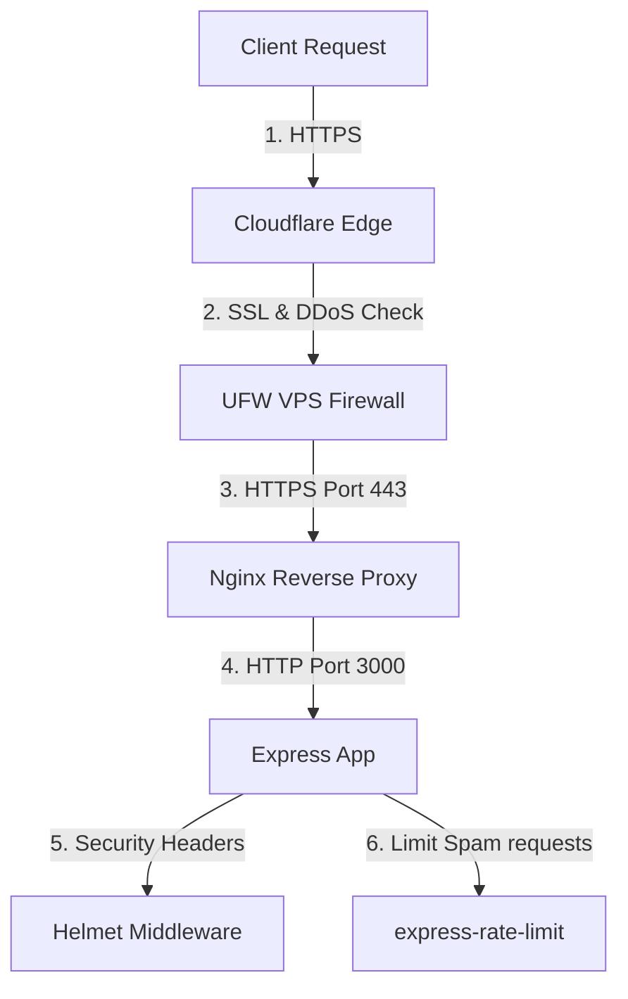

# Hive API Gateway - Security Architecture

This document describes the security protocols, sanitization, and cryptographic validations implemented in the Hive API Gateway.

---

## 1. System Security Layers



---

## 2. Active Security Middlewares

### A. Helmet Security Headers (`helmet`)
Helmet configures secure HTTP response headers to defend against common browser exploits:
* **X-Content-Type-Options**: Prevents MIME-sniffing.
* **X-Frame-Options**: Defends against Clickjacking attacks.
* **Content-Security-Policy (CSP)**: Curates valid scripts, style, and media sources.

### B. Rate Limiting (`express-rate-limit`)
To prevent Denial of Service (DoS) and brute force spam, a rate limit is applied to all incoming API paths:
* Maximum of **100 requests per 15 minutes** from a single IP address (configurable depending on endpoint type).

### C. Gzip Payload Compression (`compression`)
Compresses HTTP payloads before dispatching them to the Nginx proxy, decreasing overall download times and transfer bandwidth.

---

## 3. Input Validation & Webhook Verification

### A. Input Schema Validation (`middleware/validate.js`)
* Every POST or PUT route binds to a Joi/Zod validation schema before hitting the controller.
* **Sanitization**: Validation models check parameter types, formats, string lengths, and strip unknown properties.

### B. Webhook Cryptographic Verification
* Webhooks lack credentials and operate as public endpoints. To prevent payload spoofing, we verify cryptographic HMAC SHA256 signatures before processing requests.
* **Signature match**:
  ```javascript
  const computedHash = crypto
    .createHmac("sha256", webhookSecret)
    .update(rawPayloadBody)
    .digest("hex");
  if (computedHash !== headersSignature) {
    throw new ApiError(401, "Invalid Signature Header");
  }
  ```

---

## 4. Future Security Improvements

1. **IP Whitelisting**: Lock `/v1/webhooks/porter` to only accept traffic from Porter's official IP ranges.
2. **Secrets Rotation**: Periodically rotate the Stripe, Razorpay, and Webhook credential secrets on the PM2 server to mitigate credential leak risks.
