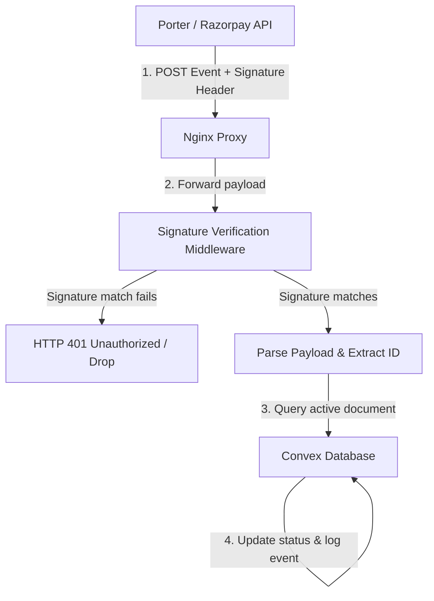

# Hive API Gateway - Webhook Integrations

This document describes how the Hive API Gateway receives, verifies, and dispatches asynchronous callback webhooks from Porter and Razorpay.

---

## 1. Webhook Architecture

Webhooks are public endpoints exposed to the internet. Because they lack standard token authorization, they must verify incoming signatures to prevent spoofing.



---

## 2. Porter Webhooks

Used to track delivery driver movements and transit changes in real-time.

* **Path**: `/v1/webhooks/porter`
* **Signature Header**: `x-api-key`
* **Convex Target**: `convex/webhooks/porter.ts`

### Webhook Verification Code:
The Porter signature is verified by comparing the `x-api-key` header value with the server's environment config:
```javascript
const signature = req.headers['x-api-key'];
const secret = process.env.PORTER_WEBHOOK_SECRET;

if (!signature || signature !== secret) {
  return res.status(401).json({ error: "Invalid signature" });
}
```

### Event Mappings:
| Porter Event | Gateway Action | Convex Database Field |
| :--- | :--- | :--- |
| `order_accepted` | Map Status | `status: "pickup_scheduled"` |
| `order_start_trip` | Map Status | `status: "in_transit"` |
| `order_end_job` | Map Status | `status: "delivered"` |

---

## 3. Razorpay Webhooks

Razorpay webhooks notify Hive of payment captures, settlement distributions, and KYC status updates.

* **Path**: `/api/webhooks/razorpay-route`
* **Signature Header**: `x-razorpay-signature`
* **Convex Target**: `api.boutiques.updateBoutiqueKycStatus`

### Webhook Cryptographic Verification:
Razorpay signatures are verified using HMAC SHA256. The payload body is hashed with the webhook secret and compared to the signature:
```javascript
import crypto from "crypto";

const signature = req.headers.get("x-razorpay-signature");
const rawBody = await req.text();
const expectedSignature = crypto
  .createHmac("sha256", process.env.RAZORPAY_ROUTE_WEBHOOK_SECRET)
  .update(rawBody)
  .digest("hex");

if (signature !== expectedSignature) {
  throw new Error("Invalid webhook signature");
}
```

### Event Mappings:
| Razorpay Event | KYC Status Map | Convex Boutique Field |
| :--- | :--- | :--- |
| `account.activated` | `"activated"` | `kycStatus: "activated"`, `razorpayAccountStatus: "active"` |
| `account.under_review` | `"under_review"` | `kycStatus: "under_review"`, `razorpayAccountStatus: "created"` |
| `account.needs_clarification` | `"needs_clarification"` | `kycStatus: "needs_clarification"`, `razorpayAccountStatus: "created"` |

---

## 4. Retries & Webhook Failures

### Partner Retries:
* Razorpay and Porter retrying rules are managed on their respective partner dashboards. They attempt back-off retries for failed delivery requests (up to 24 hours).
* To prevent timeouts causing retry cascades, the Hive API Gateway immediately acknowledges webhook receipts with an `HTTP 200 OK` response *before* executing complex long-running operations.

### Idempotency:
* If Convex receives duplicate pings for an event that has already been processed (e.g. an order is already marked `delivered`), the query is ignored, preventing duplicate settlements.
