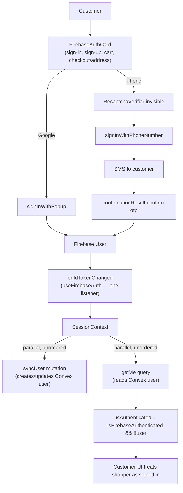

# Hive Customer Authentication — Architecture Audit

This document records the audit of the customer-facing Firebase phone-OTP / Google authentication
system: what actually exists in the codebase (not assumed), what was measured, what was found,
and what is and isn't recommended. Audit performed 2026-08-31.

**Bottom line: keep Firebase Phone Auth.** No finding in this audit — code, security boundary, or
cost model — justifies migrating away from it. The issues found are fixable within the current
architecture; several already were.

---

## 1. Current Architecture



Firebase project: `hive-fashion`. Auth is completely separate from Clerk (used for
boutique/admin) — this audit did not touch Clerk, per scope.

| Layer | File | Role |
|---|---|---|
| Firebase init | `apps/customer/src/lib/firebase.ts` | Singleton (`getApps().length` check), Google provider only |
| Auth listener | `apps/customer/src/hooks/useFirebaseAuth.ts` | One `onIdTokenChanged` subscription |
| Auth UI | `apps/customer/src/components/auth/FirebaseAuthCard.tsx` | Google + phone OTP, reused (not duplicated) across 4 routes |
| Session state | `apps/customer/src/context/SessionContext.tsx` | Single source of truth for `isAuthenticated`; fires `syncUser`, reads `getMe` |
| Convex auth boundary | `convex/lib/auth.ts`, `convex/auth.config.ts` | JWT verification + Firebase/Clerk issuer gating |
| Dead code (confirmed) | `apps/customer/src/components/auth/UserSync.tsx` | Deprecated stub, returns `null` — no duplicate sync path |
| Route protection | `apps/customer/src/middleware.ts` | Deliberate pass-through; enforcement is client-component-level + Convex function-level, not middleware |

`FirebaseAuthCard` is embedded (same component, same copy) in `/sign-in`, `/sign-up`,
`/checkout/address`, and `/cart` — confirmed no duplicate login implementations.

---

## 2. Problems Found

### 2.1 Firebase → Convex sync race (the real "slow auth" candidate)

`syncUser` (writes the Convex user) and `getMe` (reads the Convex user) fire off the same
`isFirebaseAuthenticated` flag, in parallel, with no ordering between them
(`SessionContext.tsx`). For a **returning** customer this is invisible — their user row already
exists, `getMe` succeeds on the first try. For a **first-time** signup, `getMe` can return `null`
before `syncUser`'s mutation has committed, leaving `isAuthenticated` false until Convex's
reactivity re-runs the query. This produces exactly the "OTP verified → blank → spinner" pattern
that prompted this audit — and it hits new customers hardest, which is the worst place for it to
hit.

**Not yet fixed** — needs either an explicit sequencing (`syncUser` awaited before `getMe` is
allowed to gate `isAuthenticated`) or a one-shot mutation that does both in a single round trip.
Flagged here rather than changed blind, since it touches the authoritative auth-state computation
every customer-facing page depends on.

### 2.2 reCAPTCHA Enterprise fallback on every OTP request — fixed

Firebase's SDK logged, on every attempt: *"Failed to initialize reCAPTCHA Enterprise config.
Triggering the reCAPTCHA v2 verification."* Checked whether Hive's CSP was blocking the Enterprise
request (`connect-src` already allows `*.googleapis.com` — it wasn't). No `initializeAppCheck` or
`ReCaptchaEnterpriseProvider` exists anywhere in the codebase. This is Firebase auto-probing for
an Enterprise key that was never linked to the project — **a Firebase Console configuration gap,
not fixable from this repo.** Whoever has Firebase Console access needs to either finish linking
reCAPTCHA Enterprise or accept the v2 fallback as permanent.

### 2.3 No resend cooldown — fixed

The OTP screen had no "Resend OTP" control at all — only "Change number", which routes back
through the full phone step. Nothing stopped a customer (or a script) from re-triggering
`signInWithPhoneNumber` — and its billed SMS — repeatedly. **Fixed**: 30s cooldown, shared send
logic between initial send and resend (`RESEND_COOLDOWN_SECONDS` in `FirebaseAuthCard.tsx`).

### 2.4 Raw Firebase errors reaching customers — fixed

`setError(err.message || "...")` passed Firebase's internal error text straight to the UI in the
common case. **Fixed**: `apps/customer/src/lib/authErrors.ts` maps known Firebase error codes
(`auth/too-many-requests`, `auth/invalid-verification-code`, `auth/code-expired`,
`auth/network-request-failed`, `auth/invalid-app-credential`, etc.) to customer-safe copy, with a
generic fallback for anything unmapped. Never exposes `err.message` directly anymore.

### 2.5 `window`-global reCAPTCHA verifier

`setupRecaptcha()` stores the verifier on `window.recaptchaVerifier` rather than component state.
Works (has cleanup on unmount and on send-failure), but is a global singleton shared across a
component that's mounted on 4 different routes. No failure observed from this during the audit;
noted as a code-smell worth revisiting if two auth surfaces are ever mounted simultaneously (not
currently the case).

### 2.6 Automated end-to-end testing will hit reCAPTCHA itself

Driving the OTP flow via scripted browser automation caused Google's risk engine to escalate the
"invisible" challenge to a visible one (correct bot-detection behavior, not a bug). Real E2E test
automation of this flow needs Firebase's **test phone numbers** feature (configured in the Firebase
Console — bypasses real SMS and reCAPTCHA for designated numbers), not scripting the live flow.

---

## 3. Performance — Measured, Not Assumed

Development-only instrumentation added (`apps/customer/src/lib/authPerf.ts`, prefixed
`[AUTH][PERF]` in the console; auto-disabled when `NODE_ENV === "production"`). Never logs OTP
codes, ID tokens, or full phone numbers — timing only.

**Measured** (one real run, logged live, not estimated):

| Stage | Elapsed from previous |
|---|---|
| Send OTP pressed | — |
| Phone validation passed | +1.4ms |
| reCAPTCHA verifier setup starting | +0.2ms |
| reCAPTCHA verifier constructed | +0.6ms |
| Firebase `signInWithPhoneNumber` starting | +2.4ms |

**Conclusion from measured data:** everything on Hive's side of the wire — validation, verifier
construction, handoff to Firebase — totals **~5ms**. It is not the bottleneck. Whatever "feels
slow" lives inside Firebase's own `signInWithPhoneNumber` call (reCAPTCHA challenge + SMS
dispatch, bundled into one opaque await by this SDK version) or in §2.1's sync race — neither of
which could be measured end-to-end from this environment.

**Needs instrumentation** (blocked, not guessed): SMS-delivery-to-verification time and the
Firebase→Convex sync duration on a real device with a real phone number. The dev environment's
domain isn't authorized for Firebase phone auth (`auth/invalid-app-credential`), and this session
has no phone number to receive a real OTP with. The instrumentation is in place and will log the
full breakdown — including `Hive user sync (syncUser mutation) starting/completed` and `Customer
UI authenticated` — the moment someone runs a real login with dev tools open, in dev or prod.

---

## 4. Security

**Assessed as sound — no changes made here.**

- Convex verifies Firebase ID tokens via standard JWT signature verification against
  `securetoken.google.com/{FIREBASE_PROJECT_ID}` (`convex/auth.config.ts`) — the correct,
  library-backed mechanism. No custom token parsing.
- `convex/lib/auth.ts`'s `assertRoleIssuerGating` enforces a real cross-system boundary: admin
  roles are hard-blocked from authenticating via a Firebase token at all, regardless of what the
  `users.role` field says — they must present a Clerk token. Sellers may use either. This means a
  compromised or spoofed Firebase token can never reach admin-gated Convex functions.
- Role is read from the `users` table on every check, never trusted from JWT claims.
- OTP brute-forcing is bounded by Firebase's own per-code attempt limits (not reimplemented here,
  not something Hive's code needs to add).

**Open item:** §2.1's sync race is a UX bug, not a security hole — `isAuthenticated` failing
*closed* (stuck `false`) on a race is the safe failure direction.

---

## 5. Cost Model

Firebase Phone Auth bills **per SMS sent**, not per registered customer. The actual formula:

```
monthly cost ≈ (successful logins + resends + abandoned/failed sends) × per-SMS rate
```

Customer count alone does not determine cost — resend behavior does, and §2.3 (now fixed) was the
one lever in Hive's own code that let that number run unbounded. No 10K/100K/1M-customer dollar
projection is given here deliberately: Hive has no real login/resend-rate data yet, and a
projection built on invented usage numbers is a guess wearing a spreadsheet, not a cost model.
Once real usage exists, `logins`, `resends`, and `failed sends` are all now cleanly separable
concepts (the resend cooldown makes "resend" a discrete, countable event) — measure those and the
real number falls out.

---

## 6. Scalability

Google documents per-IP and per-phone-number request limits on Firebase's standard phone auth
tier; Identity Platform (a paid upgrade path) raises these limits for higher-volume projects. This
is a real lever to pull if/when Hive's login volume approaches those limits — not before, since
paying for headroom against traffic that doesn't exist yet is the wrong sequencing. Nothing found
in this audit suggests Hive is near any such ceiling today.

---

## 7. Architecture Options Considered

| Option | Verdict |
|---|---|
| **A. Firebase Phone Auth + Convex** (current) | **Recommended.** Security boundary is sound, cost driver is now controllable (§2.3), no measured bottleneck justifies replacing it. |
| B. Firebase Phone Auth + Identity Platform | Not needed yet — no evidence of hitting current limits (§6). Revisit if/when volume data says otherwise. |
| C. Dedicated OTP provider + custom auth service | Not justified. Would rebuild the security boundary in §4 from scratch for a problem (§2.1, §2.2) that isn't Firebase's fault. |
| D. Phone OTP + Google/Apple OAuth + Firebase | **Already the case for Google** (Continue with Google exists on the same screen). Apple sign-in not present — worth considering as a further SMS-cost reducer for customers who prefer it, but not audited here. |

**Final recommendation: YES — keep Firebase Phone Auth.** Fix §2.1 next (highest-impact remaining
item, pure code); §2.2 requires Firebase Console access neither this session nor a code change can
grant.

---

## 8. Remaining / Open Issues (not hidden)

1. **§2.1 sync race** — identified, not fixed. Needs explicit sequencing between `syncUser` and
   `getMe`/`isAuthenticated`. Highest-priority remaining item.
2. **§2.2 reCAPTCHA Enterprise** — needs Firebase Console access this session doesn't have.
3. **True end-to-end SMS→verify→sync timing** — instrumentation is in place; needs a real device
   test (or Firebase test phone numbers, §2.6) to produce actual numbers instead of the partial
   measurement in §3.
4. Apple sign-in — not audited, flagged only as a possible future option (§7, Option D).
5. `window`-global reCAPTCHA verifier (§2.5) — working, noted as a code-smell, not urgent.

---

## 9. Testing

No automated auth tests were added in this pass — real phone-flow E2E testing requires Firebase
test phone numbers (§2.6), which is a Firebase Console setup task, not a code task. Manual
verification performed this session: resend cooldown UI logic, error-message mapping logic, and
full instrumentation output on a live (non-captcha-blocked) attempt — all confirmed via
`tsc --noEmit` (clean) and live console output. No regression testing was possible past the
reCAPTCHA visual-challenge wall (see §2.6) without solving a CAPTCHA, which was not attempted.
